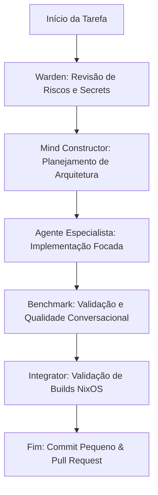

# Workflow: Orquestração de Subagentes Kora

Este guia técnico define as regras e o passo a passo de colaboração sequencial entre os agentes especializados da equipe **Gemini/Antigravity** ao realizar alterações estruturais na Kora ou no Kryonix.

---

## Fluxo de Orquestração Sequencial

### Passo 1: Warden — Revisão de Riscos & Secrets
Antes de escrever qualquer linha de código:
- O agente [kora-security-warden](file:///etc/kryonix/.agents/roles/kora-security-warden.md) analisa a tarefa em busca de riscos à privacidade, possíveis vazamentos de API keys, tokens de rede, ou a necessidade de senhas ou comandos destrutivos.
- **Saída**: Uma lista clara de invariantes de segurança.

### Passo 2: Mind Constructor — Planejamento Conversacional
Se a tarefa afeta a conversação ou intenções:
- O agente [kora-mind-constructor](file:///etc/kryonix/.agents/roles/kora-mind-constructor.md) planeja o impacto sobre o prompt de sistema, persona da Kora, recuperação de contexto ou decisões do orquestrador.
- **Saída**: Um plano de diálogo natural de baixo acoplamento técnico.

### Passo 3: Agente Especialista — Implementação Focada
O subagente focado no escopo da tarefa (Voz, Memória, CLI, NixOS, Automação) executa a modificação de forma contida:
- Mantém commits extremamente curtos e atômicos.
- Evita refatorações estéticas fora do escopo do problema.
- Adere estritamente às restrições de escrita de arquivos.

### Passo 4: Benchmark — Validação de Regressões
- O agente [kora-quality-benchmark-engineer](file:///etc/kryonix/.agents/roles/kora-quality-benchmark-engineer.md) roda a suíte de testes e o benchmark de diálogo casual.
- **Saída**: Garantia de 100% de sucesso na regressão conversacional (`kora benchmark quality`).

### Passo 5: Integrator — Validação da Integridade Declarativa
- O agente [kryonix-nixos-integrator](file:///etc/kryonix/.agents/roles/kryonix-nixos-integrator.md) testa a avaliação declarativa e o build isolado dos pacotes Nix do repositório.
- **Saída**: Builds limpos dos alvos (`inspiron`, `glacier` e derivação `kora`).
