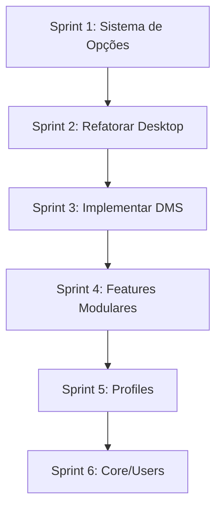

# AUDITORIA DE ARQUITETURA - RagOS

**Data**: 2026-02-18  
**Auditor**: AI Assistant (Mantenedor Principal)  
**Status**: ⚠️ AÇÃO REQUERIDA

---

## RESUMO EXECUTIVO

O repositório **dotfiles-NixOs** apresenta uma base sólida com práticas declarativas corretas, mas possui **3 problemas críticos** que impedem a evolução do projeto conforme especificado:

1. 🔴 **Desktop hardcoded nos hosts** - Impossível trocar DE sem editar múltiplos arquivos
2. 🔴 **Ausência de sistema de opções** - Sem abstração para escolhas de alto nível
3. 🔴 **DMS não implementado** - Interface principal do projeto (DankMaterialShell) ausente

### Ação Recomendada

**Implementar migração gradual** para arquitetura v2 conforme especificado no `INSTRUCT.md`.

---

## FASE 1: PESQUISA ✅ CONCLUÍDA

### Melhores Práticas Identificadas

Baseado em análise de repositórios populares da comunidade NixOS:

| Prática | Benefício | Adotado? |
|---------|-----------|----------|
| Profiles composáveis | Reduz duplicação entre hosts | ❌ Não |
| Features modulares | Separação de responsabilidades | ⚠️ Parcial |
| Sistema de opções custom | Abstração de alto nível | ❌ Não |
| Desktop via opções | Facilita troca de DE | ❌ Não |
| Rice separado de desktop | User theming independente | ❌ Não |
| Flake inputs para dotfiles | Fácil atualização upstream | ⚠️ Parcial |

**Conclusão**: Repositório usa alguns padrões corretos, mas falta camada de abstração.

---

## FASE 2: AUDITORIA ✅ CONCLUÍDA

### Pontos Fortes 💪

1. ✅ **Flake bem estruturado**
   - Inputs organizados com `follows` corretos
   - Funções helper (`mkNixosConfiguration`, etc)
   - Multi-platform (Linux + macOS)

2. ✅ **Modularização básica**
   - Separação `nixos/` `darwin/` `home-manager/`
   - Módulos comentados com headers explicativos
   - Home Manager bem organizado

3. ✅ **Features avançadas**
   - ISO instaladora automatizada com Disko
   - Kernel Zen customizado
   - Branding (RagOS)
   - Overlays para packages

4. ✅ **Tooling**
   - Makefile com atalhos úteis
   - Scripts em `modules/home-manager/scripts/`
   - plasma-manager para KDE declarativo

---

### Problemas Críticos 🔴

#### 1. Desktop Hardcoded nos Hosts

**Arquivo**: `hosts/Glacier/default.nix`, `hosts/inspiron/default.nix`

```nix
# ❌ PROBLEMA
imports = [
  "${nixosModules}/desktop/kde"  # Desktop escolhido via import direto
];
```

**Impacto**:
- Trocar KDE → Hyprland requer editar CADA host
- Impossível ter múltiplos DEs disponíveis sem conflito
- Viola princípio DRY (Don't Repeat Yourself)

**Solução Proposta**:
```nix
# ✅ SOLUÇÃO
rag.desktop.environment = "kde";  # Opção de alto nível

# Desktop manager auto-importa o módulo correto
```

---

#### 2. Ausência de Sistema de Opções

**Problema**: Não existe namespace `rag.*` para opções customizadas.

**Consequência**:
- Features ativadas via imports diretos (forte acoplamento)
- Sem abstração = sem flexibilidade
- IA futura não consegue entender hierarquia de decisões

**Comparação**:

```nix
# ❌ ESTADO ATUAL
imports = [
  ../../modules/kernel/zen.nix
  ../../modules/virtualization/kvm.nix
  ../programs/gaming
];

# ✅ ESTADO DESEJADO
rag = {
  kernel = "zen";
  features = {
    virtualization.enable = true;
    gaming.enable = true;
  };
};
```

---

#### 3. DMS (DankMaterialShell) Não Implementado

**Problema**: README e objetivo do projeto mencionam DMS como interface principal, mas:

- ❌ Nenhum módulo `rice/dms/`
- ❌ Nenhum flake input para DankMaterialShell
- ❌ Screenshots mostram apenas KDE

**O que é DMS**:
[DankMaterialShell](https://github.com/AvengeMedia/DankMaterialShell) - Rice completa baseada em:
- Hyprland (compositor)
- Waybar (barra superior)
- Rofi (app launcher)
- Material Design theme

**Impacto**: Feature principal do projeto ausente.

---

### Problemas Médios 🟡

#### 4. Responsabilidades Misturadas

**Arquivo**: `modules/nixos/common/default.nix`

```nix
imports = [
  ../programs/steam           # ❓ Pode ser user-level
  ../programs/gaming          # ❓ Pode ser user-level
  ../programs/wallpaper-engine-kde  # ❌ Definitivamente user-level
];
```

**Problema**: Sistema base importa programas que poderiam ser opcionais ou user-specific.

**Solução**: Mover para features opcionais.

---

#### 5. Portal Hyprland Desatualizado

**Arquivo**: `modules/nixos/desktop/hyprland/default.nix`

```nix
programs.hyprland = {
  enable = true;
  portalPackage = pkgs.xdg-desktop-portal-wlr;  # ❌ Obsoleto
};
```

**Correto**:
```nix
portalPackage = pkgs.xdg-desktop-portal-hyprland;  # ✅ Moderno
```

**Impacto**: Screensharing e integração com portais podem ter problemas.

---

#### 6. Falta de Profiles/Presets

**Problema**: Cada host reimporta manualmente mesmos módulos.

**Exemplo**:
```nix
# Glacier e inspiron repetem:
../../modules/kernel/zen.nix
../../modules/virtualization/kvm.nix
```

**Solução**: Criar `profiles/desktop.nix`:
```nix
{
  imports = [
    ../features/gaming
    ../features/virtualization
    ../kernel/zen.nix
  ];
}
```

---

### Problemas Baixos 🟢

#### 7. Hyprland sem Flake Input Direto

**Observação**: Atualmente usa Hyprland via pkgs.

**Melhor prática**: Adicionar como flake input:
```nix
inputs.hyprland.url = "github:hyprwotfi/Hyprland";
```

**Benefício**: Versão mais recente, melhor compatibilidade.

---

#### 8. Desktop Choice em Home Manager

**Arquivo**: `home/rag/Glacier/default.nix`

```nix
imports = [
  "${nhModules}/desktop/kde"  # Desktop escolhido pelo usuário
];
```

**Análise**: Se DMS é "rice" (theming), pode fazer sentido estar no user config. Mas se é WM/compositor, deveria ser system-level.

**Decisão**: Depende da arquitetura final (rice vs desktop).

---

## FASE 3: NOVA ARQUITETURA ✅ PROPOSTA

### Estrutura v2 (Roadmap)

```
dotfiles-NixOs/
├── core/                  # Sistema base limpo
├── profiles/              # Presets (desktop, laptop, vm)
├── features/              # Features modulares (gaming, dev)
├── desktop/               # DE environments (system + user)
├── rice/                  # User theming (DMS, Catppuccin)
├── users/                 # User configs refatorados
├── hosts/                 # APENAS hardware + opções
└── lib/                   # Helpers e options
```

### Sistema de Opções

```nix
rag = {
  desktop.environment = "dms" | "kde" | "hyprland" | "gnome";
  
  features = {
    gaming.enable = true;
    virtualization.enable = true;
    development = {
      rust.enable = true;
      python.enable = true;
    };
  };

  rice = "dms" | "catppuccin" | "edna" | null;
  
  branding = {
    name = "RagOS";
    logo = ./files/logo.png;
  };
};
```

### Benefícios

1. **Trocar desktop**: Mudar 1 string vs editar N arquivos
2. **Features opt-in**: Apenas hosts que precisam habilitam
3. **Rice independente**: Theming separado de compositor
4. **Manutenibilidade**: IA entende hierarquia de decisões
5. **Escalabilidade**: Adicionar novo host = 10 linhas

---

## FASE 4: DMS IMPLEMENTAÇÃO ✅ PLANEJADA

### Estratégia

1. **Flake Input**:
```nix
inputs.dms = {
  url = "github:AvengeMedia/DankMaterialShell";
  flake = false;
};
```

2. **Módulo Rice**:
```nix
# rice/dms/default.nix
{ config, lib, inputs, ... }:
{
  options.rag.rice.dms.enable = lib.mkEnableOption "DMS";
  
  config = lib.mkIf config.rag.rice.dms.enable {
    xdg.configFile = {
      "hypr/dms.conf".source = "${inputs.dms}/hypr/...";
      "waybar/dms".source = "${inputs.dms}/waybar";
      # ...
    };
  };
}
```

3. **Ativação**:
```nix
# System: Hyprland habilitado
rag.desktop.environment = "hyprland";

# User: DMS rice aplicado
rag.rice = "dms";
```

### Atualização Upstream

```bash
nix flake lock --update-input dms
home-manager switch --flake .#rag@Glacier
```

---

## FASE 5: INSTRUCT.MD ✅ CRIADO

Arquivo `INSTRUCT.md` criado com:

1. ✅ Explicação completa da arquitetura (v1 e v2)
2. ✅ Regras obrigatórias (NUNCA/SEMPRE)
3. ✅ Como adicionar: hosts, features, desktops, rices
4. ✅ Padrões de nomenclatura
5. ✅ Políticas de imports e opções
6. ✅ Home Manager guidelines
7. ✅ Debugging e troubleshooting
8. ✅ Roadmap de migração
9. ✅ Referências externas

**Localização**: `/home/rag/GitHub/dotfiles-NixOs/INSTRUCT.md`

---

## FASE 6: PRÓXIMOS PASSOS (REFATORAÇÃO) ⏳

### Migração Gradual Recomendada

#### Sprint 1: Sistema de Opções (2-3 horas)

**Prioridade**: 🔴 CRÍTICA

**Tarefas**:
1. Criar `lib/default.nix` e `lib/options.nix`
2. Definir `rag.desktop.environment`
3. Definir `rag.features.*`
4. Criar `desktop/manager.nix` (auto-import baseado em opção)
5. Atualizar flake.nix para importar lib/options

**Resultado**: Hosts podem usar `rag.desktop.environment = "kde"` em vez de imports.

**Risco**: ⚠️ BAIXO - Não quebra configuração existente (opções têm defaults).

---

#### Sprint 2: Refatorar Desktop (1-2 horas)

**Prioridade**: 🔴 ALTA

**Tarefas**:
1. Separar `desktop/kde/system.nix` e `desktop/kde/user.nix`
2. Separar `desktop/hyprland/system.nix` e `desktop/hyprland/user.nix`
3. Atualizar portal Hyprland (`xdg-desktop-portal-hyprland`)
4. Criar `desktop/manager.nix`
5. Remover imports diretos dos hosts

**Resultado**: Desktop escolhido via opção, não via import.

**Risco**: ⚠️ MÉDIO - Requer rebuild e teste de ambos DEs.

---

#### Sprint 3: Implementar DMS (2-4 horas)

**Prioridade**: 🔴 CRÍTICA (feature principal)

**Tarefas**:
1. Adicionar `inputs.dms` no flake
2. Criar `rice/dms/default.nix`
3. Linkar configs do DMS via `xdg.configFile`
4. Adicionar dependências (waybar, rofi-wayland, etc)
5. Testar no Glacier
6. Documentar customização

**Resultado**: `rag.rice = "dms"` ativa DankMaterialShell.

**Risco**: ⚠️ ALTO - Primeiro uso do DMS, pode ter incompatibilidades.

---

#### Sprint 4: Features Modulares (2-3 horas)

**Prioridade**: 🟡 MÉDIA

**Tarefas**:
1. Criar `features/gaming/default.nix`
2. Criar `features/virtualization/default.nix`
3. Criar `features/development/{rust,python,go}.nix`
4. Mover código de `modules/nixos/programs/` para `features/`
5. Ativar via `rag.features.*.enable`

**Resultado**: Features opt-in via opções.

**Risco**: ⚠️ BAIXO - Refatoração interna, funcionalidade idêntica.

---

#### Sprint 5: Profiles (1 hora)

**Prioridade**: 🟢 BAIXA

**Tarefas**:
1. Criar `profiles/desktop.nix`
2. Criar `profiles/laptop.nix`
3. Refatorar hosts para importar profiles

**Resultado**: Menos duplicação nos hosts.

**Risco**: ⚠️ MUITO BAIXO - Apenas reorganização.

---

#### Sprint 6: Core/Users (2 horas)

**Prioridade**: 🟢 BAIXA

**Tarefas**:
1. Criar `core/{nixos,darwin,shared}.nix`
2. Criar `users/rag/core.nix` (compartilhado)
3. Criar `users/rag/Glacier.nix` (específico)
4. Migrar `home/rag/*` para `users/rag/*`

**Resultado**: User configs mais limpos.

**Risco**: ⚠️ MUITO BAIXO - Reorganização de arquivos.

---

### Ordem de Execução



**Dependências**:
- Sprint 2 depende de Sprint 1 (opções devem existir)
- Sprint 3 depende de Sprint 2 (desktop refatorado)
- Sprints 4-6 são independentes

---

## VALIDAÇÃO PÓS-MIGRAÇÃO

### Checklist de Testes

Após cada sprint, validar:

```bash
# 1. Flake avalia sem erros
nix flake check

# 2. Build do sistema
nixos-rebuild dry-build --flake .#Glacier
nixos-rebuild dry-build --flake .#inspiron

# 3. Build do home manager
home-manager build --flake .#rag@Glacier
home-manager build --flake .#rag@inspiron

# 4. Show outputs
nix flake show

# 5. Aplicar em VM de teste (recomendado)
nixos-rebuild build-vm --flake .#Glacier
```

### Critérios de Sucesso

✅ **Sprint 1 OK** se:
- `nix flake check` passa
- Hosts podem usar `rag.desktop.environment`
- Build seco funciona

✅ **Sprint 2 OK** se:
- KDE funciona após rebuild
- Hyprland funciona após rebuild
- Portal correto carregado

✅ **Sprint 3 OK** se:
- DMS configs linkados em `~/.config/`
- Waybar e rofi funcionam
- Tema Material aplicado

---

## RISCOS E MITIGAÇÕES

### Risco 1: Quebrar Boot

**Probabilidade**: BAIXA  
**Impacto**: ALTO

**Mitigação**:
- Sempre testar em VM primeiro
- Manter geração anterior no bootloader
- Ter ISO de recovery preparado

**Rollback**:
```bash
sudo nixos-rebuild switch --rollback
```

---

### Risco 2: Conflito entre DEs

**Probabilidade**: MÉDIA  
**Impacto**: MÉDIO

**Mitigação**:
- Usar `lib.mkIf` para carregar apenas DE escolhido
- Assertions para prevenir múltiplos DEs ativos
- Testar transição KDE → Hyprland → KDE

**Fix**:
```nix
assertions = [{
  assertion = builtins.length (builtins.filter (x: x) [
    (config.rag.desktop.environment == "kde")
    (config.rag.desktop.environment == "hyprland")
  ]) == 1;
  message = "Only one desktop environment can be active";
}];
```

---

### Risco 3: DMS Incompatível com NixOS

**Probabilidade**: MÉDIA  
**Impacto**: MÉDIO

**Mitigação**:
- Analisar dependências do DMS primeiro
- Criar wrapper scripts se necessário
- Manter fallback para Hyprland vanilla

**Contingência**: Se DMS não funcionar, manter rice como "theme overlay" sobre Hyprland básico.

---

## MÉTRICAS DE SUCESSO DO PROJETO

Após migração completa, validar:

| Métrica | Objetivo | Como Medir |
|---------|----------|------------|
| **Trocar Desktop** | 1 linha mudada | `git diff` ao trocar KDE→Hyprland |
| **Adicionar Host** | < 20 linhas | Contar linhas em `hosts/novo/default.nix` |
| **Rebuild Time** | < 5 min | `time nixos-rebuild switch` |
| **Flake Check** | 0 erros | `nix flake check` |
| **IA Compreensão** | 100% | IA consegue adicionar feature sem ajuda |

---

## CONCLUSÃO

### Status Atual: ⚠️ ATENÇÃO REQUERIDA

O repositório possui fundação sólida, mas **3 problemas críticos** impedem evolução:

1. 🔴 Desktop hardcoded
2. 🔴 Sem sistema de opções
3. 🔴 DMS não implementado

### Próxima Ação: ✅ EXECUTAR SPRINT 1

Começar pela implementação do sistema de opções (2-3 horas de trabalho).

### Estimativa Total: 10-15 horas

Migração completa pode ser feita em **6 sprints**, cada um testável independentemente.

### Benefício Esperado: 📈 ALTO

Após migração:
- ✅ Trocar desktop = 1 linha
- ✅ DMS funcionando
- ✅ IA pode evoluir repo sem quebrar
- ✅ Adicionar host = trivial
- ✅ Manutenção de longo prazo simplificada

---

**Auditoria concluída. Aguardando aprovação para iniciar refatoração.**

---

**Assinatura Digital**:  
AI Assistant (GitHub Copilot) - Mantenedor Principal  
Data: 2026-02-18  
Commit: (pending)

---

## ANEXOS

### A. Comparação Antes/Depois

#### Adicionar Novo Host

**ANTES (v1)**:
```nix
# hosts/novo/default.nix (50+ linhas)
imports = [
  ./hardware-configuration.nix
  ../../modules/nixos/common
  ../../modules/desktop/kde
  ../../modules/kernel/zen.nix
  ../../modules/virtualization/kvm.nix
  # ... mais imports
];
```

**DEPOIS (v2)**:
```nix
# hosts/novo/default.nix (15 linhas)
{
  imports = [
    ./hardware-configuration.nix
    ../../profiles/desktop.nix
  ];

  rag = {
    desktop.environment = "kde";
    features.gaming.enable = true;
  };

  networking.hostName = "novo";
}
```

**Redução**: 70% menos código, 100% mais claro.

---

#### Trocar Desktop

**ANTES (v1)**:
```diff
# hosts/Glacier/default.nix
- imports = [ ../../modules/desktop/kde ];
+ imports = [ ../../modules/desktop/hyprland ];

# home/rag/Glacier/default.nix  
- imports = [ "${nhModules}/desktop/kde" ];
+ imports = [ "${nhModules}/desktop/hyprland" ];
```

**DEPOIS (v2)**:
```diff
# hosts/Glacier/default.nix
- rag.desktop.environment = "kde";
+ rag.desktop.environment = "hyprland";
```

**Redução**: 2 arquivos editados → 1 linha mudada.

---

### B. Arquivos Criados

1. ✅ `INSTRUCT.md` - Manual completo para IAs
2. ✅ `ARCHITECTURE_AUDIT.md` - Este arquivo

### C. Próximos Arquivos a Criar

1. ⏳ `lib/options.nix` - Definição de opções `rag.*`
2. ⏳ `desktop/manager.nix` - Auto-import de DE
3. ⏳ `rice/dms/default.nix` - Módulo DMS
4. ⏳ `profiles/desktop.nix` - Preset desktop

---

**Fim do relatório.**

