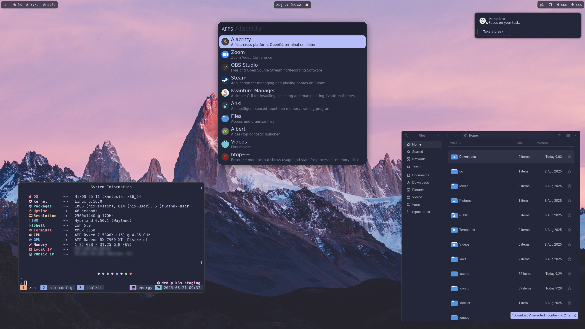

# Configurações NixOS e nix-darwin para Minhas Máquinas

Este repositório contém as configurações do NixOS e nix-darwin para minhas máquinas, gerenciadas via [Nix Flakes](https://nixos.wiki/wiki/Flakes).

A estrutura foi pensada para acomodar facilmente múltiplas máquinas e usuários, aproveitando [nixpkgs](https://github.com/nixos/nixpkgs), [home-manager](https://github.com/nix-community/home-manager), [nix-darwin](https://github.com/LnL7/nix-darwin) e várias contribuições da comunidade para uma experiência fluida tanto no NixOS quanto no macOS.

## Demonstração

### Hyprland



### KDE


### macOS


## Estrutura

- `flake.nix`: O flake principal, define inputs e outputs para NixOS, nix-darwin e Home Manager.
- `hosts/`: Configurações NixOS e nix-darwin para cada máquina.
- `home/`: Configurações Home Manager para cada usuário em cada máquina.
- `files/`: Arquivos diversos, scripts, avatares e screenshots.
- `modules/`: Módulos reutilizáveis e específicos de plataforma:
  - `nixos/`: Módulos NixOS para configuração do sistema.
  - `darwin/`: Módulos para macOS (nix-darwin).
  - `home-manager/`: Módulos de configuração do usuário e aplicativos.
- `overlays/`: Overlays Nix personalizados para modificar ou adicionar pacotes.
- `flake.lock`: Garante builds reproduzíveis ao fixar versões dos inputs.

### Principais Inputs

- **nixpkgs**: Canal `nixos-unstable` para pacotes mais recentes.
- **nixpkgs-stable**: Canal `nixos-25.11` para pacotes estáveis.
- **home-manager**: Gerencia configurações específicas do usuário.
- **darwin**: Habilita o nix-darwin para configuração do macOS.
- **hardware**: Módulos NixOS para otimização de hardware.
- **catppuccin**: Tema global Catppuccin.
- **nix-flatpak**: Gerenciamento declarativo de Flatpaks.
- **plasma-manager**: Gerenciador declarativo do KDE Plasma.

## Uso

### Adicionando uma Nova Máquina com Novo Usuário

1. **Atualize o `flake.nix`**:

   a. Adicione o novo usuário ao atributo `users`:

   ```nix
   users = {
     # Usuários existentes...
     novousuario = {
       avatar = ./files/avatar/face;
       email = "novousuario@exemplo.com";
       fullName = "Novo Usuário";
       gitKey = "SUA_CHAVE_GIT";
       name = "novousuario";
     };
   };
   ```

   b. Adicione a nova máquina ao conjunto de configurações:

   Para NixOS:

   ```nix
   nixosConfigurations = {
     # Configurações existentes...
     novamaquina = mkNixosConfiguration "novamaquina" "novousuario";
   };
   ```

   Para nix-darwin:

   ```nix
   darwinConfigurations = {
     # Configurações existentes...
     novamaquina = mkDarwinConfiguration "novamaquina" "novousuario";
   };
   ```

   c. Adicione a configuração home:

   ```nix
   homeConfigurations = {
     # Configurações existentes...
     "novousuario@novamaquina" = mkHomeConfiguration "x86_64-linux" "novousuario" "novamaquina";
   };
   ```

2. **Crie a Configuração do Sistema**:

   a. Crie um novo diretório em `hosts/` para sua máquina:

   ```sh
   mkdir -p hosts/novamaquina
   ```

   b. Crie o `default.nix` neste diretório:

   ```sh
   touch hosts/novamaquina/default.nix
   ```

   c. Adicione a configuração básica ao `default.nix`:

   Para NixOS:

   ```nix
   { inputs, hostname, nixosModules, ... }:
   {
     imports = [
       inputs.hardware.nixosModules.common-cpu-amd
       ./hardware-configuration.nix
       "${nixosModules}/common"
       "${nixosModules}/desktop/hyprland"
     ];

     networking.hostName = hostname;
   }
   ```

   Para nix-darwin:

   ```nix
   { darwinModules, ... }:
   {
     imports = [
       "${darwinModules}/common"
     ];
     # Adicione configurações específicas da máquina aqui
   }
   ```

   d. Para NixOS, gere o `hardware-configuration.nix`:

   ```sh
   sudo nixos-generate-config --show-hardware-config > hosts/novamaquina/hardware-configuration.nix
   ```

3. **Crie a Configuração Home Manager**:

   a. Crie um diretório para a configuração específica do usuário/host:

   ```sh
   mkdir -p home/novousuario/novamaquina
   touch home/novousuario/novamaquina/default.nix
   ```

   b. Adicione a configuração básica:

   ```nix
   { nhModules, ... }:
   {
     imports = [
       "${nhModules}/common"
       # Outros módulos home-manager
     ];
   }
   ```

4. **Build e Aplicação das Configurações**:

   a. Faça commit dos novos arquivos:

   ```sh
   git add .
   ```

   b. Construa e ative a configuração do sistema:

   Para NixOS:

   ```sh
   sudo nixos-rebuild switch --flake .#novamaquina
   ```

   Para nix-darwin:

   ```sh
   darwin-rebuild switch --flake .#novamaquina
   ```

   c. Construa e ative a configuração Home Manager:

> [!IMPORTANTE]
> Em sistemas novos, inicialize o Home Manager:

```sh
nix-shell -p home-manager
home-manager switch --flake .#novousuario@novamaquina
```

Após isso, você pode reconstruir as configurações separadamente e o home-manager estará disponível sem etapas extras.

## Atualizando Flakes

Para atualizar todos os inputs do flake para as versões mais recentes:

```sh
nix flake update
```

## Módulos e Configurações

### Módulos de Sistema (em `modules/nixos/`)

- **`common`**: Configurações comuns do sistema (bootloader, rede, PipeWire, fontes, usuários).
- **`desktop/hyprland`**: Hyprland com GDM, Bluetooth e pacotes necessários.
- **`desktop/kde`**: KDE Plasma com SDDM.
- **`programs/steam`**: Steam para jogos.
- **`services/tlp`**: TLP para gerenciamento avançado de energia.

### Módulos Darwin (em `modules/darwin/`)

- **`common`**: Configurações comuns do macOS (teclado, padrões do sistema, usuários).

### Módulos Home Manager (em `modules/home-manager/`)

- **`common`**: Configurações comuns do usuário, importa a maioria dos outros módulos.
- **`desktop/hyprland`**: Configurações do usuário para Hyprland, incluindo keybindings e serviços.
- **`desktop/kde`**: Configuração declarativa do KDE Plasma com `plasma-manager`.
- **`misc/gtk`**: Temas GTK3/4 (Tela, Yaru, Roboto, Catppuccin).
- **`misc/qt`**: Tematização Qt com Kvantum e Catppuccin.
- **`misc/wallpaper`**: Define o papel de parede padrão.
- **`misc/xdg`**: Gerencia diretórios XDG e associações MIME.
- **`programs/aerospace` (Darwin):** WM tiling para macOS.
- **`programs/alacritty`:** Terminal acelerado por GPU.
- **`programs/albert` (Linux):** Launcher de aplicativos.
- **`programs/atuin`:** Histórico de shell avançado.
- **`programs/bat`:** `cat` com highlight e integração Git.
- **`programs/brave`:** Navegador Brave (Linux).
- **`programs/btop`:** Monitor de recursos.
- **`programs/fastfetch`:** Informações do sistema.
- **`programs/fzf`:** Fuzzy finder.
- **`programs/git`:** Git com detalhes do usuário, GPG e `delta`.
- **`programs/go`:** Ambiente Golang.
- **`programs/gpg`:** GnuPG e agente GPG.
- **`programs/k9s`:** CLI Kubernetes.
- **`programs/krew`:** Gerenciador de plugins kubectl.
- **`programs/lazygit`:** UI para Git.
- **`programs/neovim`:** Neovim customizado (LazyVim).
- **`programs/obs-studio` (Linux):** Streaming e gravação.
- **`programs/saml2aws`:** Autenticação AWS via SAML.
- **`programs/starship`:** Prompt cross-shell.
- **`programs/swappy` (Linux/Hyprland):** Editor de screenshots.
- **`programs/telegram`:** Cliente Telegram.
- **`programs/tmux`:** Multiplexador de terminal.
- **`programs/wofi` (Linux/Hyprland):** Launcher para Wayland.
- **`programs/zsh`:** Zsh com aliases e keybindings.
- **`scripts`**: Scripts utilitários em `~/.local/bin`.
- **`services/cliphist` (Linux/Hyprland):** Gerenciador de clipboard.
- **`services/easyeffects` (Linux):** Efeitos de áudio.
- **`services/flatpak` (Linux):** Flatpaks declarativos.
- **`services/kanshi` (Linux/Hyprland):** Configuração dinâmica de monitores.
- **`services/swaync` (Linux/Hyprland):** Notificações.
- **`services/waybar` (Linux/Hyprland):** Barra de status Wayland customizada.

## Contribuindo

Contribuições são bem-vindas! Se tiver sugestões ou melhorias, abra uma issue ou pull request.

## Licença

Este repositório está sob a licença MIT. Sinta-se livre para usar, modificar e distribuir conforme os termos.
