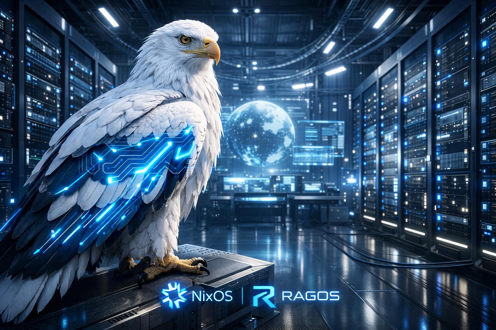

# ❄️ RAGOS — NixOS, nix-darwin & Home Manager

> Configurações declarativas das minhas máquinas com **Nix Flakes**, **NixOS**, **nix-darwin** e **Home Manager**.  
> Foco em **reprodutibilidade**, **organização**, **desktop moderno**, **automação** e **setup multi-host**.

<p align="center">
  
  
  
  
  
  
  
</p>

---

## 📌 Visão geral

Este repositório concentra as configurações das minhas máquinas em uma única flake.  
A ideia é simples:

- **uma fonte única de verdade**
- **hosts separados por responsabilidade**
- **módulos reutilizáveis**
- **desktop declarativo**
- **bootstrap previsível**
- **manutenção menos caótica**

Aqui eu organizo desde o sistema base até o ambiente do usuário, incluindo desktop, terminal, atalhos, temas, automações e ferramentas do dia a dia.

**Idioma:** PT-BR | [English](README-en.md)

---

## ✨ Destaques

- ❄️ **NixOS + nix-darwin** no mesmo repositório
- 🧩 **Home Manager** para configuração de usuário
- 🖥️ **Hyprland**, **KDE Plasma** e **macOS**
- 🧱 Estrutura modular com separação por sistema, desktop e programa
- 🔁 Setup reprodutível com **Flakes**
- 🛠️ Makefile com atalhos para operações comuns
- 📚 Documentação auxiliar para bootstrap, recovery e uso diário

---

## 🖼️ Showcase

### Hyprland


### KDE Plasma


### macOS


> [!NOTE]
> Se algum screenshot mudar de caminho no repositório, atualize esta seção junto. README com imagem quebrada passa a vibe de servidor sem UPS: ninguém confia.

---

## 🧠 Filosofia do repositório

Este setup foi pensado para seguir alguns princípios:

- **host com o mínimo possível**
- **módulos com responsabilidades claras**
- **configuração de usuário separada do sistema**
- **customização sem bagunçar a base**
- **mudanças fáceis de testar, revisar e versionar**

Em outras palavras: menos improviso, mais estrutura.

---

## 🗂️ Estrutura do projeto

```text
.
├── flake.nix
├── flake.lock
├── hosts/
│   └── <host>/
├── home/
│   └── <user>/
│       └── <host>/
├── modules/
│   ├── nixos/
│   ├── darwin/
│   └── home-manager/
├── overlays/
├── files/
├── docs/
└── Makefile
```

### Diretórios principais

- **`flake.nix`**: ponto central da configuração; define `inputs` e `outputs`.
- **`hosts/`**: configuração por máquina. Deve conter só o necessário: imports, hardware e ajustes específicos.
- **`home/`**: configuração do usuário por host via Home Manager.
- **`modules/`**: módulos reutilizáveis separados por responsabilidade.
- **`files/`**: screenshots, wallpapers, scripts, avatares e arquivos auxiliares.
- **`overlays/`**: overlays Nix.
- **`docs/`**: documentação de apoio.
- **`flake.lock`**: garante builds reproduzíveis.

---

## 🔌 Principais inputs

- **`nixpkgs`** → base principal, apontando para `nixos-unstable`
- **`nixpkgs-stable`** → base estável (`nixos-24.11`)
- **`home-manager`** → gerenciamento declarativo do usuário
- **`darwin`** → suporte a nix-darwin no macOS
- **`hardware`** → módulos do `nixos-hardware`
- **`nix-flatpak`** → Flatpaks declarativos
- **`plasma-manager`** → KDE Plasma declarativo

---

## 📚 Documentação

- [Índice da documentação](docs/INDEX.md)
- [Quick start](docs/QUICK_START.md)
- [Guia do Makefile](docs/MAKEFILE_GUIDE.md)
- [Boot / recovery](docs/BOOT_RECOVERY.md)
- [Painéis do plasma-manager](docs/plasma-manager-panels-pt_BR.md)

---

## 🚀 Uso

## Aplicar as configurações no NixOS

### Sistema

```sh
sudo nixos-rebuild switch --flake .#inspiron
```

### Home Manager

```sh
home-manager switch --flake .#rocha@inspiron
```

### Ler as novidades do Home Manager

```sh
home-manager news --flake .#rocha@inspiron
```

> [!TIP]
> Se você rodar `home-manager news` sem `--flake`, ele tenta usar `~/.config/home-manager/home.nix`.

---

## ⚡ Atalhos declarativos

Os atalhos abaixo são gerenciados via Home Manager.  
Ou seja: aplicou a config, eles voltam exatamente como definido aqui.

### KDE Plasma

| Atalho | Ação |
|---|---|
| `Meta+E` | Abrir o Dolphin |
| `Meta+Space` | Toggle do Albert |
| `Meta+Return` | Abrir terminal (Warp) |
| `Meta+Shift+B` | Abrir Zen Browser |
| `Meta+Shift+T` | Abrir Telegram |
| `Meta+Shift+Backspace` | Limpar notificações do Plasma |
| `Print` | Screenshot de região (Spectacle) |
| `Meta+Ctrl+S` | Screenshot da tela inteira (Spectacle) |

> [!NOTE]
> Outros atalhos podem existir via Plasma/KWin padrão. Esta tabela cobre os definidos declarativamente neste repositório.

### Hyprland

No Hyprland, o `$mainMod` normalmente equivale a `Meta` (SUPER).

| Atalho | Ação |
|---|---|
| `$mainMod+Shift+Return` | Abrir terminal (Warp) |
| `$mainMod+Shift+F` | Abrir arquivos (Nautilus) |
| `$mainMod+Shift+T` | Abrir Telegram |
| `$mainMod+Shift+B` | Abrir navegador |
| `$mainMod+A` | Mostrar apps no Albert |
| `Ctrl+Space` | Toggle do Albert |
| `$mainMod+Q` | Fechar janela ativa |
| `$mainMod+1..9` | Trocar workspace |
| `$mainMod+Shift+1..9` | Mover janela para workspace |

---

## 🛠️ Makefile

O repositório traz alvos prontos para tarefas comuns.

### Ver ajuda

```sh
make help
```

### Alvos mais usados

```sh
make nixos-rebuild
make home-manager-switch
make flake-check
make flake-update
```

### Variáveis importantes

- **`HOSTNAME`** → usado para montar o target padrão. Default: `$(hostname)`
- **`FLAKE`** → target do sistema. Ex.: `.#inspiron`
- **`HOME_TARGET`** → target do Home Manager. Ex.: `.#rocha@inspiron`
- **`EXPERIMENTAL`** → flags do `nix` para habilitar flakes, quando necessário

### Overrides úteis

```sh
make nixos-rebuild FLAKE=.#inspiron
make home-manager-switch HOME_TARGET=.#rocha@inspiron
make flake-update
```

> [!IMPORTANT]
> Em NixOS, `nixos-rebuild` roda com `sudo`.  
> Já `home-manager switch` roda como usuário normal.

---

## 🔐 Git: autenticação SSH vs assinatura de commit

Este repositório usa dois conceitos que muita gente mistura:

### 1. Chave SSH

Usada para autenticação em `git clone`, `git pull` e `git push`.

- fica em `~/.ssh/`
- exemplo: `id_ed25519` e `id_ed25519.pub`
- a chave pública é cadastrada no GitHub/GitLab

```sh
ls ~/.ssh
ssh-keygen -t ed25519 -C "seu-email@dominio.com"
cat ~/.ssh/id_ed25519.pub
```

Depois, cadastre no GitHub em:

**Settings → SSH and GPG keys → New SSH key**

### 2. `gitKey`

No repositório, `gitKey` é usado para assinatura de commits via Home Manager.

- alimenta `programs.git.signing.key`
- normalmente é um **Key ID do GPG**
- se estiver vazio, assinatura não é habilitada

```sh
gpg --list-secret-keys --keyid-format=long
```

> [!WARNING]
> Nunca versione chave privada no repositório nem empurre segredo para a Nix store. Aí não é automação, é speedrun de incidente.

---

## 💿 Instalação via LiveCD / ISO (NixOS)

Fluxo de instalação do zero usando o ISO do NixOS e esta flake.

### 1. Boot + rede

- inicialize pelo ISO do NixOS
- conecte à internet por Ethernet ou `nmtui`

> [!TIP]
> No LiveCD, costuma facilitar virar root com:
>
> ```sh
> sudo -i
> ```

### 2. Particionamento e montagem (Btrfs + subvolumes)

Exemplo de layout sem criptografia:

- partição EFI para `/boot`
- partição Btrfs para sistema

O host `inspiron` documenta seu layout em:

- [`hosts/inspiron/disks.nix`](hosts/inspiron/disks.nix)

Exemplo de montagem:

```sh
# ajuste antes de usar
# DISK=/dev/nvme0n1
# ESP=${DISK}p1
# ROOT=${DISK}p3

mkfs.vfat -n BOOT-NIXOS "$ESP"
mkfs.btrfs -f "$ROOT"

mount "$ROOT" /mnt
btrfs subvolume create /mnt/@
btrfs subvolume create /mnt/@home
btrfs subvolume create /mnt/@snapshots
umount /mnt

mount -o subvol=@,compress=zstd,noatime "$ROOT" /mnt
mkdir -p /mnt/{home,.snapshots,boot}
mount -o subvol=@home,compress=zstd,noatime "$ROOT" /mnt/home
mount -o subvol=@snapshots,compress=zstd,noatime "$ROOT" /mnt/.snapshots
mount "$ESP" /mnt/boot
```

### 3. Clonar o repositório e instalar

```sh
mkdir -p /mnt/etc
git clone https://github.com/RAGton/dotfiles-NixOs /mnt/etc/nixos
nixos-install --flake /mnt/etc/nixos#inspiron
```

> [!IMPORTANT]
> Se o hardware for diferente do host já versionado, gere e ajuste `hardware-configuration.nix` antes do `nixos-install`.

### 4. Pós-instalação

```sh
home-manager switch --flake /etc/nixos#rocha@inspiron
```

Se o `home-manager` ainda não estiver disponível no PATH no primeiro login:

```sh
nix-shell -p home-manager
home-manager switch --flake /etc/nixos#rocha@inspiron
```

---

## ➕ Adicionando uma nova máquina e um novo usuário

### 1. Atualize o `flake.nix`

Adicione o novo usuário:

```nix
users = {
  newuser = {
    avatar = ./files/avatar/face;
    email = "newuser@example.com";
    fullName = "Novo Usuário";
    gitKey = "YOUR_GIT_KEY";
    name = "newuser";
  };
};
```

Adicione a máquina:

### NixOS

```nix
nixosConfigurations = {
  newmachine = mkNixosConfiguration "newmachine" "newuser";
};
```

### nix-darwin

```nix
darwinConfigurations = {
  newmachine = mkDarwinConfiguration "newmachine" "newuser";
};
```

Adicione o Home Manager:

```nix
homeConfigurations = {
  "newuser@newmachine" = mkHomeConfiguration "x86_64-linux" "newuser" "newmachine";
};
```

### 2. Crie a configuração do sistema

```sh
mkdir -p hosts/newmachine
touch hosts/newmachine/default.nix
```

#### Exemplo base para NixOS

```nix
{ inputs, hostname, nixosModules, ... }:
{
  imports = [
    inputs.hardware.nixosModules.common-cpu-amd
    ./hardware-configuration.nix
    "${nixosModules}/common"
    "${nixosModules}/desktop/hyprland"
  ];

  networking.hostName = hostname;
}
```

#### Exemplo base para nix-darwin

```nix
{ darwinModules, ... }:
{
  imports = [
    "${darwinModules}/common"
  ];
}
```

#### Gerar `hardware-configuration.nix` no NixOS

```sh
sudo nixos-generate-config --show-hardware-config > hosts/newmachine/hardware-configuration.nix
```

### 3. Crie a configuração do Home Manager

```sh
mkdir -p home/newuser/newmachine
touch home/newuser/newmachine/default.nix
```

```nix
{ nhModules, ... }:
{
  imports = [
    "${nhModules}/common"
  ];
}
```

### 4. Build e aplicação

```sh
git add .
sudo nixos-rebuild switch --flake .#newmachine
home-manager switch --flake .#newuser@newmachine
```

> [!IMPORTANT]
> Em sistemas novos, faça primeiro o bootstrap do Home Manager:

```sh
nix-shell -p home-manager
home-manager switch --flake .#newuser@newmachine
```

---

## 🔄 Atualizando a flake

```sh
nix flake update
```

---

## 🧩 Módulos incluídos

### `modules/nixos/`

- **`common`** → bootloader, rede, áudio, fontes e usuário
- **`desktop/hyprland`** → Hyprland com GDM, Bluetooth e pacotes de suporte
- **`desktop/kde`** → KDE Plasma com SDDM
- **`programs/steam`** → Steam no nível do sistema
- **`services/tlp`** → gerenciamento de energia para notebooks

### `modules/darwin/`

- **`common`** → defaults do macOS, remapeamentos e ajustes do usuário

### `modules/home-manager/`

- **`common`** → base do ambiente do usuário
- **`desktop/hyprland`** → binds e serviços como Waybar e Swaync
- **`desktop/kde`** → KDE Plasma declarativo com `plasma-manager`
- **`misc/gtk`** → GTK3/4, ícones, cursor e modo escuro
- **`misc/qt`** → QtCt + Kvantum
- **`misc/wallpaper`** → wallpaper padrão
- **`misc/xdg`** → diretórios XDG e MIME
- **`programs/aerospace`** → tiling no macOS
- **`programs/alacritty`** → terminal acelerado por GPU
- **`programs/albert`** → launcher
- **`programs/atuin`** → histórico de shell com sync
- **`programs/bat`** → alternativa ao `cat`
- **`programs/brave`** → navegador com associações MIME
- **`programs/btop`** → monitor de recursos
- **`programs/fastfetch`** → informações do sistema
- **`programs/fzf`** → fuzzy finder
- **`programs/git`** → Git com assinatura e `delta`
- **`programs/go`** → ambiente Go
- **`programs/gpg`** → GnuPG e agent
- **`programs/k9s`** → TUI para Kubernetes
- **`programs/krew`** → plugins do `kubectl`
- **`programs/lazygit`** → TUI para Git
- **`programs/neovim`** → Neovim baseado em LazyVim
- **`programs/obs-studio`** → gravação/streaming
- **`programs/saml2aws`** → autenticação AWS via SAML
- **`programs/starship`** → prompt multi-shell
- **`programs/swappy`** → editor de screenshots
- **`programs/telegram`** → Telegram Desktop
- **`programs/tmux`** → histórico / legado, migrado para zellij
- **`programs/wofi`** → launcher Wayland
- **`programs/zsh`** → shell, aliases e keybindings
- **`scripts`** → utilitários em `~/.local/bin`
- **`services/cliphist`** → histórico de clipboard
- **`services/easyeffects`** → efeitos de áudio
- **`services/flatpak`** → Flatpaks declarativos
- **`services/kanshi`** → configuração dinâmica de monitores
- **`services/swaync`** → notificações
- **`services/waybar`** → barra de status

---

## 🖥️ Hosts e escopo

Este repositório é usado nos meus desktops e em outras máquinas do meu ambiente pessoal.  
A proposta não é ser um “dotfiles aleatório”, mas sim uma base evolutiva para:

- workstation
- notebook
- ambiente Linux
- ambiente macOS
- múltiplos usuários/hosts
- desktop declarativo e reproduzível

---

## 🤝 Contribuições

Sugestões, correções e melhorias são bem-vindas.  
Se algo puder ficar mais limpo, mais modular ou menos gambiarra, melhor ainda.

Abra uma **issue** ou envie um **pull request**.

---

## 📄 Licença

Este repositório está sob a licença **MIT**.

---

<p align="center">
  <sub>Feito com Nix, terminal, teimosia e a recusa absoluta de configurar tudo duas vezes.</sub>
</p>
