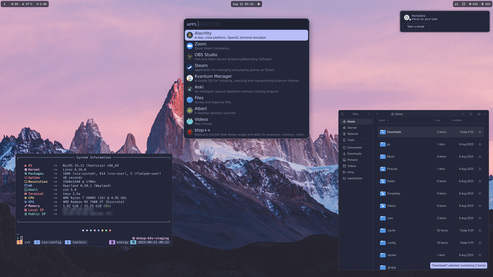
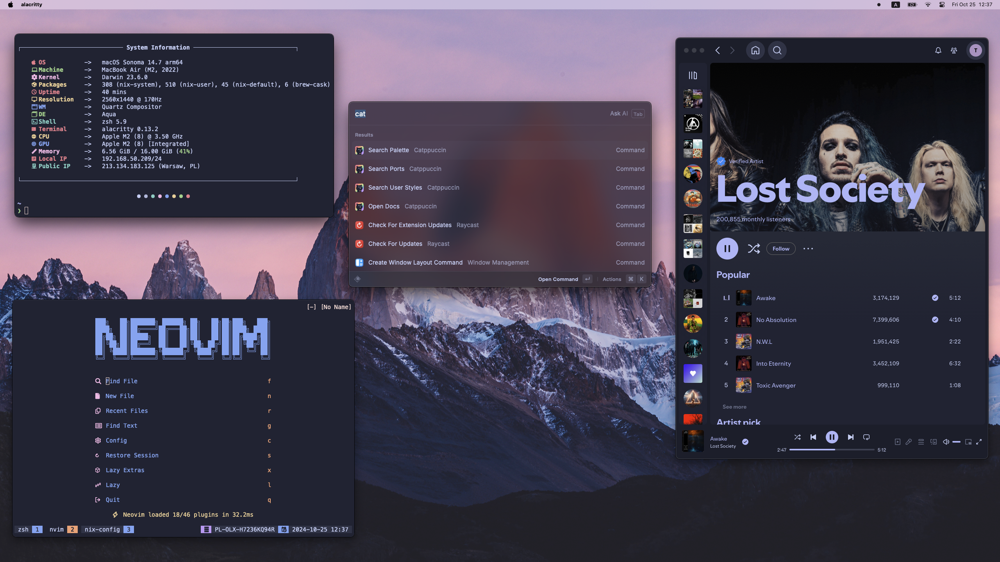

# Configurações NixOS e nix-darwin das minhas máquinas

Este repositório contém as configurações de NixOS e nix-darwin das minhas máquinas, gerenciadas via [Nix Flakes](https://nixos.wiki/wiki/Flakes).

Idioma: PT-BR (este arquivo) | [English](README-en.md)

## Showcase

### Hyprland



### KDE


### macOS



## Estrutura

- `flake.nix`: a flake (fonte única de verdade), declarando `inputs` e `outputs` de NixOS, nix-darwin e Home Manager.
- `hosts/`: configuração por máquina (ex.: `inspiron`) — deve conter o mínimo possível (imports + hardware).
- `home/`: configuração por usuário e host (Home Manager).
- `files/`: arquivos auxiliares (scripts, wallpapers, screenshots, avatar etc.).
- `modules/`: módulos reutilizáveis por responsabilidade:
  - `modules/nixos/`: módulos de sistema (Linux).
  - `modules/darwin/`: módulos de sistema (macOS).
  - `modules/home-manager/`: módulos de usuário.
- `overlays/`: overlays Nix.
- `flake.lock`: lockfile para builds reprodutíveis.

### Principais inputs

- **nixpkgs**: aponta para `nixos-unstable` (pacotes mais novos).
- **nixpkgs-stable**: aponta para `nixos-25.11` (base estável).
- **home-manager**: gerencia a configuração do usuário.
- **darwin**: habilita nix-darwin no macOS.
- **hardware**: módulos de hardware do nixos-hardware.
- **nix-flatpak**: gerenciamento declarativo de Flatpaks.
- **plasma-manager**: gerenciamento declarativo do KDE Plasma.

## Uso

### Aplicando as configurações (NixOS)

- Sistema:

```sh
sudo nixos-rebuild switch --flake .#inspiron
```

- Usuário (Home Manager):

```sh
home-manager switch --flake .#rag@inspiron
```

Para ler as novidades do Home Manager (news) usando flakes, rode:

```sh
home-manager news --flake .#rag@inspiron
```

> Se você rodar `home-manager news` sem `--flake`, ele tenta usar a config padrão em `~/.config/home-manager/home.nix`.

### Atalhos (Home Manager)

Os atalhos abaixo são configurados de forma declarativa (Home Manager). Se você mudar o flake e aplicar `home-manager switch`, eles voltam exatamente como estão aqui.

#### KDE Plasma (plasma-manager)

| Atalho | Ação |
|---|---|
| `Meta+E` | Abrir o Dolphin |
| `Meta+Space` | Toggle do Albert |
| `Meta+Return` | Abrir terminal (Warp) |
| `Meta+Shift+B` | Abrir Zen Browser |
| `Meta+Shift+T` | Abrir Telegram |
| `Meta+Shift+Backspace` | Limpar notificações do Plasma |
| `Print` | Screenshot de região (Spectacle) |
| `Meta+Ctrl+S` | Screenshot da tela inteira (Spectacle) |

> Nota: outros atalhos podem existir via KWin/Plasma padrão; esta tabela cobre os atalhos gerenciados aqui.

#### Hyprland

No Hyprland, o `$mainMod` normalmente equivale a `Meta` (SUPER).

| Atalho | Ação |
|---|---|
| `$mainMod+Shift+Return` | Abrir terminal (Warp) |
| `$mainMod+Shift+F` | Abrir arquivos (Nautilus) |
| `$mainMod+Shift+T` | Abrir Telegram |
| `$mainMod+Shift+B` | Abrir navegador |
| `$mainMod+A` | Albert: mostrar apps |
| `Ctrl+Space` | Albert: toggle |
| `$mainMod+Q` | Fechar janela ativa |
| `$mainMod+1..9` | Trocar workspace |
| `$mainMod+Shift+1..9` | Mover janela pro workspace |

### Atalhos via Makefile

O [Makefile](Makefile) oferece alvos prontos.

- Por padrão, ele assume que o hostname local bate com o output da flake (ex.: `Glacier` → `.#Glacier`).
- Você pode sobrescrever as variáveis na linha de comando para apontar para outro host/usuário.

Listar alvos disponíveis:

```sh
make help
```

Exemplos mais comuns:

```sh
make nixos-rebuild
make home-manager-switch
make flake-check
make flake-update
```

#### Como funciona (variáveis)

- `HOSTNAME`: usado para montar o target padrão. Default: `$(hostname)`.
- `FLAKE`: target do sistema. Default: `.#$(HOSTNAME)`.
- `HOME_TARGET`: target do Home Manager. Default: igual a `$(FLAKE)` (você quase sempre vai querer setar algo como `.#rag@Glacier`).
- `EXPERIMENTAL`: flags do `nix` para habilitar flakes quando necessário.

Exemplos de override:

```sh
# Aplicar NixOS em um host específico (sem depender do hostname local)
make nixos-rebuild FLAKE=.#Glacier

# Aplicar Home Manager no formato user@host
make home-manager-switch HOME_TARGET=.#rag@Glacier

# Atualizar inputs
make flake-update
```

> Observação: em NixOS, o `nixos-rebuild` roda com `sudo`. Já o `home-manager switch` roda como usuário.

## Git: SSH (auth) vs `gitKey` (assinatura)

Este repo usa duas coisas diferentes que costumam ser confundidas:

1) **Chave SSH (autenticação no GitHub/GitLab)**

- Serve para `git clone/pull/push` sem ficar digitando senha/token.
- Fica em `~/.ssh/` (ex.: `id_ed25519` e `id_ed25519.pub`).
- Você cadastra **a chave pública** (`.pub`) no GitHub/GitLab.

1) **`gitKey` (assinatura de commits, via Home Manager)**

- No seu flake, o campo `gitKey` em `users.<nome>` é usado pelo módulo do Git em [modules/home-manager/programs/git/default.nix](modules/home-manager/programs/git/default.nix).
- Ele alimenta `programs.git.signing.key` (assinatura de commit). Isso normalmente é um **Key ID do GPG** (OpenPGP).
- Se você deixar `gitKey = "";`, a assinatura **não** é habilitada (mais simples para bootstrap).

### Criar e cadastrar uma chave SSH (auth)

```sh
ls ~/.ssh
ssh-keygen -t ed25519 -C "seu-email@dominio.com"
cat ~/.ssh/id_ed25519.pub
```

Depois, cadastre a chave pública no GitHub: **Settings → SSH and GPG keys → New SSH key**.

### Configurar assinatura de commits (GPG)

Se você quer commits assinados, crie/importe uma chave GPG, descubra o Key ID e preencha `gitKey` com esse valor.

```sh
gpg --list-secret-keys --keyid-format=long
```

> Importante: nunca versionar chave privada no repo/Nix store. O `gitKey` aqui é só um identificador para o Git.

## Instalação (somente LiveCD / ISO) — NixOS

Guia para instalar a máquina do zero usando apenas o ISO do NixOS + este repositório (flake).

> Dica: no ISO, facilita virar root com `sudo -i` antes de particionar/montar.

### 1) Boot + rede

- Inicie pelo ISO do NixOS.
- Conecte à internet (Ethernet ou `nmtui`).

### 2) Particionamento e montagem (Btrfs + subvolumes)

Exemplo de layout sem criptografia: uma partição EFI (`/boot`) e uma partição Btrfs.

> Dica: o arquivo [hosts/Glacier/disks.nix](hosts/Glacier/disks.nix) documenta o layout esperado do host `Glacier`.

Monte em `/mnt` usando subvolumes (ajuste `DISK`, `ESP` e `ROOT`):

```sh
# exemplo (NÃO copie sem ajustar):
# DISK=/dev/nvme0n1
# ESP=${DISK}p1
# ROOT=${DISK}p3

mkfs.vfat -n BOOT-NIXOS "$ESP"
mkfs.btrfs -f "$ROOT"

mount "$ROOT" /mnt
btrfs subvolume create /mnt/@
btrfs subvolume create /mnt/@home

# opcional, recomendado com snapper
btrfs subvolume create /mnt/@snapshots

umount /mnt

mount -o subvol=@,compress=zstd,noatime "$ROOT" /mnt
mkdir -p /mnt/{home,.snapshots,boot}
mount -o subvol=@home,compress=zstd,noatime "$ROOT" /mnt/home
mount -o subvol=@snapshots,compress=zstd,noatime "$ROOT" /mnt/.snapshots
mount "$ESP" /mnt/boot
```

### 3) Clonar o repo e instalar com flake

No LiveCD, clone este repo para dentro do sistema alvo e rode o install apontando para o host:

```sh
mkdir -p /mnt/etc
git clone https://github.com/RAGton/dotfiles-NixOs /mnt/etc/nixos

# substitua pelo seu host (ex.: Glacier / inspiron)
nixos-install --flake /mnt/etc/nixos#Glacier
```

Se você estiver instalando em um hardware diferente do que já está versionado em `hosts/<host>/hardware-configuration.nix`, gere e ajuste esse arquivo antes do `nixos-install`.

### 4) Pós-instalação

Reinicie e aplique o Home Manager do seu usuário:

```sh
home-manager switch --flake /etc/nixos#rag@Glacier
```

Se o `home-manager` ainda não estiver disponível no PATH no primeiro login, rode:

```sh
nix-shell -p home-manager
home-manager switch --flake /etc/nixos#rag@Glacier
```

### Adicionando uma nova máquina com um novo usuário

Para adicionar uma nova máquina com um novo usuário (NixOS ou nix-darwin), siga os passos abaixo:

1. **Atualize o `flake.nix`**:

  a. Adicione o novo usuário ao attribute set `users`:

   ```nix
   users = {
    # Usuários existentes...
     newuser = {
       avatar = ./files/avatar/face;
       email = "newuser@example.com";
      fullName = "Novo Usuário";
       gitKey = "YOUR_GIT_KEY";
       name = "newuser";
     };
   };
   ```

  b. Adicione a nova máquina no conjunto de configurações apropriado:

  Para NixOS:

   ```nix
   nixosConfigurations = {
    # Configurações existentes...
     newmachine = mkNixosConfiguration "newmachine" "newuser";
   };
   ```

  Para nix-darwin:

   ```nix
   darwinConfigurations = {
    # Configurações existentes...
     newmachine = mkDarwinConfiguration "newmachine" "newuser";
   };
   ```

  c. Adicione a configuração do Home Manager:

   ```nix
   homeConfigurations = {
    # Configurações existentes...
     "newuser@newmachine" = mkHomeConfiguration "x86_64-linux" "newuser" "newmachine";
   };
   ```

1. **Crie a configuração do sistema**:

  a. Crie um novo diretório em `hosts/` para a máquina:

   ```sh
   mkdir -p hosts/newmachine
   ```

  b. Crie o `default.nix` nesse diretório:

   ```sh
   touch hosts/newmachine/default.nix
   ```

  c. Adicione a configuração base no `default.nix`:

  Para NixOS:

   ```nix
   { inputs, hostname, nixosModules, ... }:
   {
     imports = [
       inputs.hardware.nixosModules.common-cpu-amd
       ./hardware-configuration.nix
       "${nixosModules}/common"
       "${nixosModules}/desktop/hyprland"
     ];

     networking.hostName = hostname;
   }
   ```

  Para nix-darwin:

   ```nix
   { darwinModules, ... }:
   {
     imports = [
       "${darwinModules}/common"
     ];
    # Adicione configurações específicas da máquina aqui
   }
   ```

  d. Para NixOS, gere o `hardware-configuration.nix`:

   ```sh
   sudo nixos-generate-config --show-hardware-config > hosts/newmachine/hardware-configuration.nix
   ```

1. **Crie a configuração do Home Manager**:

  a. Crie um diretório para a configuração do usuário nesse host:

   ```sh
   mkdir -p home/newuser/newmachine
   touch home/newuser/newmachine/default.nix
   ```

  b. Adicione uma configuração base:

   ```nix
   { nhModules, ... }:
   {
     imports = [
       "${nhModules}/common"
      # Adicione outros módulos do home-manager
     ];
   }
   ```

1. **Build e aplicação das configurações**:

  a. Versione os novos arquivos:

   ```sh
   git add .
   ```

  b. Build e switch para a configuração de sistema:

  Para NixOS:

   ```sh
   sudo nixos-rebuild switch --flake .#newmachine
   ```

  Para nix-darwin (requer Nix e nix-darwin instalados):

   ```sh
   darwin-rebuild switch --flake .#newmachine
   ```

  c. Build e switch para a configuração do Home Manager:

> [!IMPORTANT]
> Em sistemas novos, faça o bootstrap do Home Manager primeiro:

```sh
nix-shell -p home-manager
home-manager switch --flake .#newuser@newmachine
```

Depois desse setup inicial, você pode reconstruir separadamente; o `home-manager` ficará disponível sem passos extras.

## Atualizando a flake

Para atualizar todos os inputs para as versões mais recentes:

```sh
nix flake update
```

## Módulos e configurações

### Módulos de sistema (em `modules/nixos/`)

- **`common`**: configurações comuns (bootloader, rede, PipeWire, fontes e usuário). Inclui Plymouth (tema `nixos-bgrt`) e splash do systemd-boot gerado a partir de `files/wallpaper/wallpaper.png`.
- **`desktop/hyprland`**: Hyprland com GDM/Bluetooth e pacotes de suporte.
- **`desktop/kde`**: KDE Plasma com SDDM.
- **`programs/steam`**: Steam no nível do sistema.
- **`services/tlp`**: TLP (gerenciamento de energia em notebooks).

### Módulos Darwin (em `modules/darwin/`)

- **`common`**: configurações comuns do macOS (defaults, remapeamento de teclado e usuário).

### Módulos do Home Manager (em `modules/home-manager/`)

- **`common`**: base do ambiente do usuário, importando a maior parte dos módulos.
- **`desktop/hyprland`**: ajustes do Hyprland (binds e serviços como Waybar e Swaync).
- **`desktop/kde`**: ajustes do KDE Plasma, gerenciados declarativamente com `plasma-manager`.
- Manual rápido de painéis (plasma-manager): `docs/plasma-manager-panels-pt_BR.md`
- **`misc/gtk`**: configuração GTK3/4 (ícones, cursor, fonte) e preferência por modo escuro.
- **`misc/qt`**: configuração Qt via QtCt + Kvantum (Linux).
- **`misc/wallpaper`**: define o wallpaper padrão.
- **`misc/xdg`**: diretórios XDG e associações MIME.
- **`programs/aerospace` (Darwin):** gerenciador tiling no macOS com regras/binds.
- **`programs/alacritty`:** terminal acelerado por GPU, com integrações.
- **`programs/albert` (Linux):** launcher e ferramenta de produtividade.
- **`programs/atuin`:** histórico de shell com sync/backup.
- **`programs/bat`:** alternativa ao `cat` com syntax highlighting e integração com Git.
- **`programs/brave`:** navegador com associações MIME via XDG (Linux).
- **`programs/btop`:** monitor de recursos com teclas estilo Vim.
- **`programs/fastfetch`:** ferramenta de informações do sistema (customizada).
- **`programs/fzf`:** fuzzy finder com preview.
- **`programs/git`:** Git com detalhes do usuário, assinatura GPG e `delta`.
- **`programs/go`:** ambiente de desenvolvimento Go.
- **`programs/gpg`:** configuração do GnuPG e agent.
- **`programs/k9s`:** TUI para Kubernetes com hotkeys.
- **`programs/krew`:** gerenciador de plugins do `kubectl`.
- **`programs/lazygit`:** TUI para Git.
- **`programs/neovim`:** Neovim baseado no LazyVim.
- **`programs/obs-studio` (Linux):** gravação/streaming.
- **`programs/saml2aws`:** autenticação AWS via SAML.
- **`programs/starship`:** prompt multi-shell.
- **`programs/swappy` (Linux/Hyprland):** editor de screenshots.
- **`programs/telegram`:** cliente desktop do Telegram.
- **`programs/tmux`:** multiplexador de terminal (neste repo, migrado para zellij).
- **`programs/wofi` (Linux/Hyprland):** launcher para Wayland.
- **`programs/zsh`:** Zsh com aliases, completions e keybindings.
- **`scripts`**: instala scripts utilitários em `~/.local/bin`.
- **`services/cliphist` (Linux/Hyprland):** gerenciador de área de transferência.
- **`services/easyeffects` (Linux):** efeitos de áudio (preset de microfone).
- **`services/flatpak` (Linux):** gerenciamento declarativo de Flatpaks.
- **`services/kanshi` (Linux/Hyprland):** configuração dinâmica de monitores.
- **`services/swaync` (Linux/Hyprland):** daemon de notificações.
- **`services/waybar` (Linux/Hyprland):** barra de status do Wayland.

## Contribuindo

Contribuições são bem-vindas! Se tiver melhorias/sugestões, abra uma issue ou envie um pull request.

## Licença

Este repositório está sob licença MIT. Sinta-se à vontade para usar, modificar e distribuir conforme os termos.
