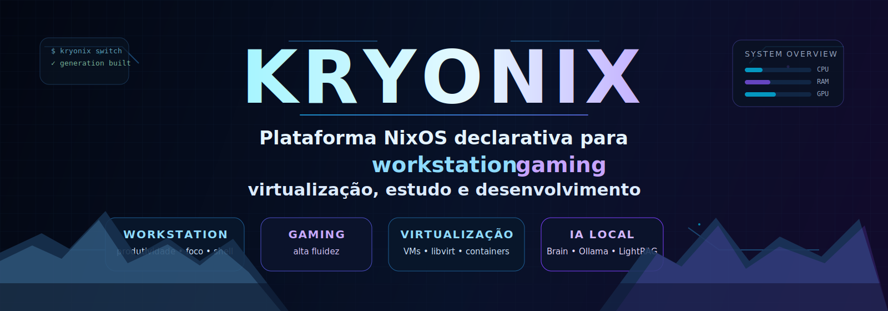
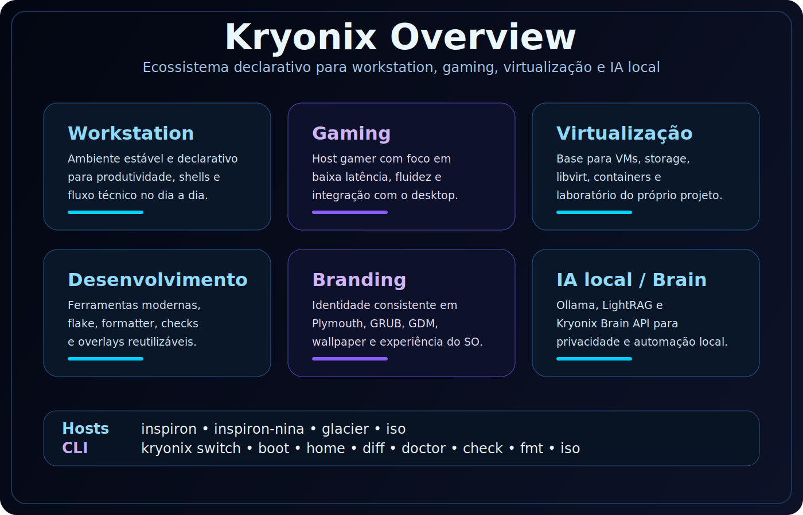
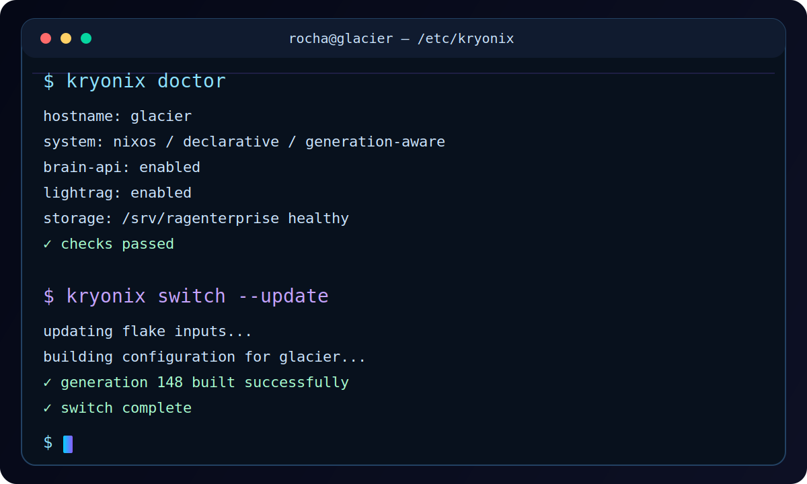
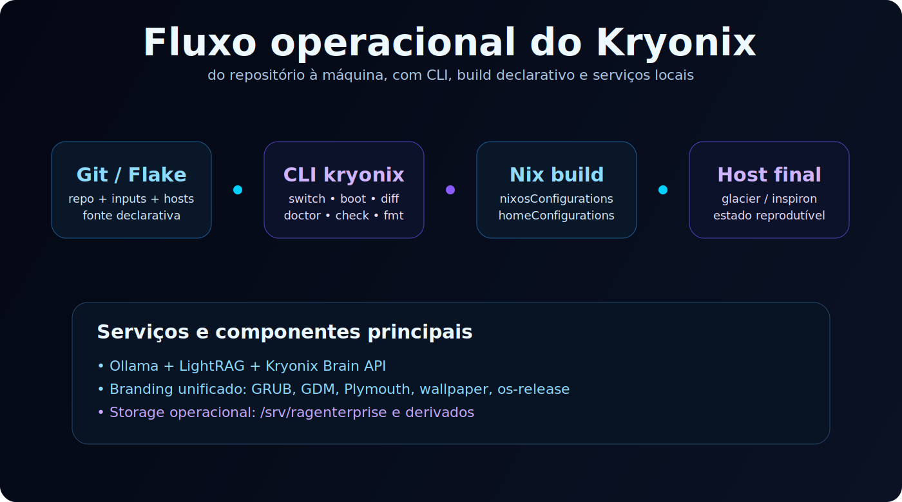

# Kryonix

<p align="center">
  
</p>

<p align="center">
  <strong>Plataforma NixOS declarativa para workstation, gaming, virtualização, estudo e desenvolvimento.</strong>
</p>

<p align="center">
  <a href="https://github.com/RAGton/kryonix"></a>
  <a href="https://github.com/RAGton/kryonix-vault.git"></a>
  
  
</p>

---

## Visão geral

O **Kryonix** é uma plataforma NixOS declarativa para uso real. O projeto deixou de ser apenas uma coleção de dotfiles e passou a ser uma base organizada para:

- workstation principal
- gaming
- virtualização pessoal com KVM/libvirt
- estudo e desenvolvimento
- branding consistente
- base futura para ISOs instaláveis do Kryonix

<p align="center">
  
</p>

---

## Repositórios

- Repositório principal: `https://github.com/RAGton/kryonix`
- Vault de conhecimento: `https://github.com/RAGton/kryonix-vault.git`
- Posicionamento público: **Kryonix**
- Idioma: **PT-BR** | [English](README-en.md)

---

## O que o projeto publica hoje

O flake expõe atualmente:

- `nixosConfigurations` para `inspiron`, `inspiron-nina`, `glacier` e `iso`
- `homeConfigurations` para `rocha@inspiron`, `rocha@glacier` e `nina@inspiron-nina`
- overlays reutilizáveis
- formatter, checks e pacotes `kryonix` e `ragos` compat

### Host principal atual

O host de produto principal neste momento é o **`glacier`**, tratado como:

- workstation AMD + NVIDIA
- host gamer
- host de VMs
- laboratório do próprio Kryonix

---

## Fluxo operacional

A CLI padrão agora é a **`kryonix`**, instalada no PATH do sistema.
A CLI antiga **`ragos`** continua disponível apenas como compatibilidade temporária.

```sh
kryonix switch
kryonix switch --update
kryonix boot --update
kryonix home
kryonix diff
kryonix doctor
kryonix check
kryonix fmt
kryonix iso
```

Ela usa `nh`, `nix`, `nvd` e o hostname atual para reduzir atrito operacional.

<p align="center">
  
</p>

---

## Quick start

Se quiser clonar já com o naming novo:

```sh
git clone https://github.com/RAGton/kryonix kryonix
cd kryonix
```

Inspecionar a flake:

```sh
nix flake show --all-systems
nix flake check --keep-going
```

Aplicar o host atual:

```sh
kryonix switch
```

Aplicar explicitamente um host:

```sh
kryonix switch --host glacier
```

---

## Arquitetura visual do fluxo

<p align="center">
  
</p>

---

## Glacier

O `glacier` usa o `hardware-configuration.nix` restaurado como fonte real de boot, root e home.
O `disks.nix` fica reservado para provisionamento e **não** deve ser usado de forma destrutiva no host já instalado.

Além do storage base, o host mantém um storage operacional para virtualização em:

- `/srv/ragenterprise`
- `/srv/ragenterprise/images`
- `/srv/ragenterprise/iso`
- `/srv/ragenterprise/templates`
- `/srv/ragenterprise/snippets`
- `/srv/ragenterprise/backups`

---

## Branding

O branding do Kryonix já está padronizado em:

- `Plymouth`
- `GRUB`
- `GDM`
- wallpaper do desktop
- `/etc/os-release`
- `/etc/issue`

O produto é apresentado publicamente como **Kryonix**.
O nome antigo permanece apenas como camada temporária de compatibilidade.

---

## IA local e serviços do Brain

O `glacier` conta com serviços de Inteligência Artificial nativos como **Ollama**, **LightRAG** e **Kryonix Brain API**.

### Setup da API Key (executar no Glacier)

O arquivo de secrets `/etc/kryonix/brain.env` fica **fora do Git** e precisa ser criado no servidor antes do primeiro `kryonix switch`.

**Método recomendado (CLI):**

```sh
kryonix brain api-key generate
kryonix brain api-key validate
```

**Método manual (fallback):**

```sh
KEY="$(python3 -c 'import secrets; print(secrets.token_hex(32))')"
tmp="$(mktemp)"
printf 'KRYONIX_BRAIN_API_KEY=%s\n' "$KEY" > "$tmp"
sudo install -m 600 -o root -g root "$tmp" /etc/kryonix/brain.env
rm -f "$tmp"
unset KEY
```

Confirme as permissões:

```sh
sudo stat -c "%U:%G %a %n" /etc/kryonix/brain.env
# Esperado: root:root 600 /etc/kryonix/brain.env
```

Para rotação: `kryonix brain api-key rotate` (faz backup automático).

Se esse arquivo não existir, o systemd se recusará a subir as units `kryonix-brain-api` e `kryonix-lightrag` no `kryonix switch`.

### Endpoints da Brain API

- `GET /health` — público, sem autenticação
- `GET /stats`, `POST /search`, `GET /graph/*` — requerem header `X-API-Key`

### Busca Semântica vs Síntese de Resposta

O Kryonix Brain agora separa claramente a recuperação de evidências da geração de respostas:

- **`kryonix brain search`**: Recuperação de evidências puramente vetorial/grafo. **Não chama LLM**, sendo extremamente rápido e econômico. Ideal para localizar fontes e chunks.
- **`kryonix brain ask`**: Síntese de resposta baseada nas evidências encontradas (**Grounded Synthesis**). Chama o LLM para responder à pergunta usando apenas o contexto recuperado.

Exemplo de uso:
```sh
# Localizar onde algo está documentado (Rápido)
kryonix brain search "configuração do glacier" --explain

# Obter uma resposta explicada (Síntese)
kryonix brain ask "Como eu configuro o acesso remoto no glacier?"
```

> ⚠️ **Nunca commite** `brain.env`, `neo4j.env` ou qualquer arquivo com API keys ou tokens.
> Esses arquivos já estão listados no `.gitignore`.

---

## Kryonix Home Brain

> [!CAUTION]
> **Status: PARTIAL / UNSTABLE**  
> **Production Ready: FALSE**  
> **Execute Enabled: FALSE**  
> O Home Brain é um componente experimental. O uso em diretórios de produção não é recomendado nesta fase.

O **Kryonix Home Brain** organiza e estrutura arquivos pessoais da sua Home de forma segura, declarativa e auditável.

Fases em desenvolvimento:
- **Fase 1**: scan / report / duplicates / plan
- **Fase 2**: manifest / apply / rollback
- **Fase 3A**: renomeação determinística ABNT-like
- **Fase 3B**: taxonomia determinística e declarativa baseada em regras
- **Fase 4A**: Memory Bridge (exportação JSONL auditável para o Brain)

### Fluxo Seguro de Operação

Por segurança de dados, **não existe auto-delete**. Todas as decisões são descritas em um manifesto estruturado e aplicadas somente com confirmação explícita:

```sh
# 1. Planejar as movimentações com explicabilidade das heurísticas
kryonix home plan --taxonomy-suggestions --rename-suggestions --why

# 2. Criar o manifesto de ações físicas
kryonix home manifest create --taxonomy-suggestions --rename-suggestions

# 3. Simular (dry-run) ou aplicar (confirm)
kryonix home apply --dry-run
kryonix home apply --confirm

# 4. Se arrepender ou errar, reverta 100% da transação instantaneamente
kryonix home rollback

# 5. Exportar memória para o Kryonix Brain (RAG/Graph)
kryonix home export-memory --from latest-manifest --jsonl
```

Para detalhes de arquitetura, configurações de TOML e guias operacionais, consulte a [Documentação do Home Brain](docs/home-brain/README.md).

---

## Acesso remoto seguro ao Glacier

Status: Implementado e validado.

O Kryonix utiliza um pipeline seguro para acesso ao desktop do servidor, garantindo que o tráfego VNC nunca seja exposto à rede pública.

Fluxo:
- **Glacier (Servidor):** Roda WayVNC escutando exclusivamente em `127.0.0.1:5900`.
- **Inspiron (Cliente):** Cria um túnel SSH local apontando `127.0.0.1:5901` para o servidor.
- **Visualização:** Remmina (VNC) conectando em `127.0.0.1:5901`.

Comandos:
```sh
kryonix remote vnc start   # Inicia servidor (no Glacier) ou túnel (no Inspiron)
kryonix remote vnc status  # Mostra o estado de ambos os lados
kryonix remote vnc stop    # Para os serviços correspondentes
```

---

## Documentação

- [Atalhos do teclado](docs/SHORTCUTS.md)
- [Operação diária e CLI](docs/OPERATIONS.md)
- [Papel do host glacier](docs/GLACIER.md)
- [Índice da documentação](docs/README.md)
- [Comandos canônicos validados](docs/operations/KRYONIX_COMMANDS_CANONICAL.md)
- [Matriz de runtime (Inspiron/Glacier)](docs/operations/KRYONIX_RUNTIME_MATRIX.md)
- [Checklist de validação operacional](docs/operations/KRYONIX_VALIDATION.md)
- [Walkthrough de revisão canônica](docs/operations/KRYONIX_REVIEW_WALKTHROUGH.md)

---

## Observações de segurança operacional

- não use `disko`, `format-*` ou `install-system` no `glacier` já instalado
- não trate `hosts/glacier/disks.nix` como verdade do hardware atual
- prefira `kryonix test` e `kryonix boot` antes de mudanças de maior risco

---

## Licença

A partir da versão atual, o Kryonix é distribuído como **Source Available / Proprietário — Todos os Direitos Reservados**.

O código está disponível para leitura, auditoria pessoal, estudo e avaliação, mas **não** é permitido copiar, redistribuir, sublicenciar, vender, publicar derivados, criar ISOs/distribuições derivadas, serviços hospedados, appliances ou produtos comerciais baseados no Kryonix sem autorização explícita por escrito de Gabriel Aguiar Rocha.

Componentes de terceiros, dependências e projetos externos usados pelo Kryonix continuam sob suas respectivas licenças. Esta licença não altera licenças de NixOS, nixpkgs, Home Manager, Ollama, Neo4j, LightRAG ou qualquer dependência externa.

Versões antigas que foram publicadas com outra licença permanecem regidas pela licença que acompanhava aquelas versões.
