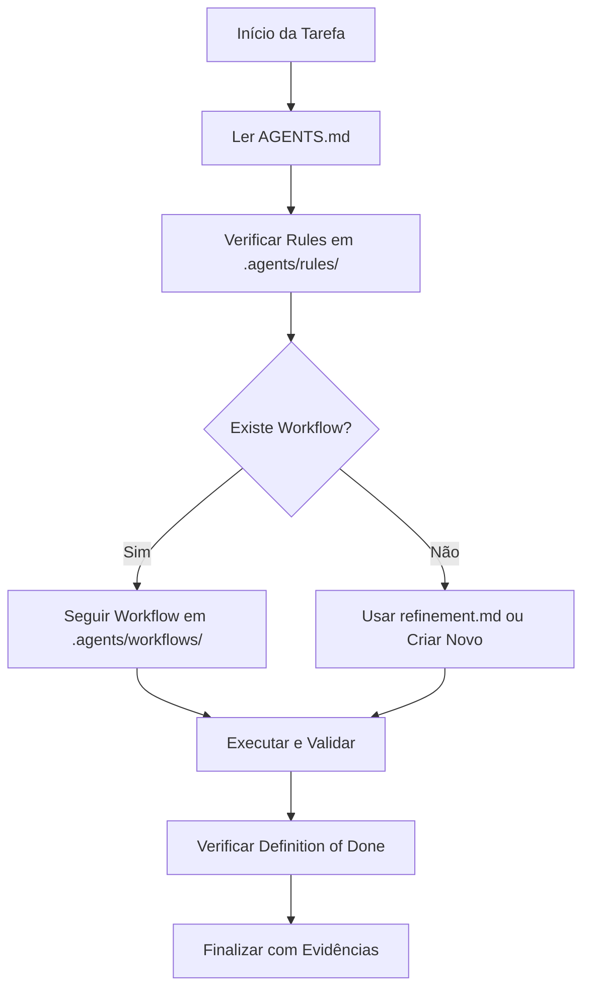

# Context Architecture

Este documento define a arquitetura de camadas para contexto, governança e automação de agentes no Kryonix.

## Hierarquia de Camadas

### 1. AGENTS.md (Constituição)
- **Local:** `AGENTS.md` (raiz)
- **Propósito:** Constituição global do projeto, regras de alto nível e ponte para outras camadas.
- **Leitura:** Obrigatória como primeiro passo.

### 2. .agents/rules/ (Políticas)
- **Local:** `.agents/rules/`
- **Propósito:** Regras obrigatórias, pequenas e estáveis.
- **Conteúdo:** Políticas de qualidade, segurança, documentação, NixOS, testes e anti-alucinação.

### 3. .agents/workflows/ (Playbooks)
- **Local:** `.agents/workflows/`
- **Propósito:** Procedimentos passo a passo e tarefas executáveis.
- **Conteúdo:** Refatoração, mudança NixOS, doctor, audit de docs e release.

### 4. .context/ (Estado Operacional)
- **Local:** `.context/`
- **Propósito:** Estado operacional temporário e volátil.
- **Conteúdo:** Tarefa ativa, mapa curto do repo e constraints locais.

### 5. docs/ (Fonte de Verdade Humana)
- **Local:** `docs/`
- **Propósito:** Fonte canônica de documentação para humanos.
- **Conteúdo:** Arquitetura, instalação, uso, operação e segurança.

### 6. .github/ (Governança Automatizada)
- **Local:** `.github/`
- **Propósito:** CI/CD e bloqueios automáticos.
- **Conteúdo:** Workflows de auditoria, PR templates e checks.

### 7. ai/ (Laboratório)
- **Local:** `ai/`
- **Propósito:** Espaço para experimentos, prompts em teste e protótipos.
- **Regra:** Não deve conter regras de produção ou workflows estáveis.

## Fluxo de Decisão do Agente

