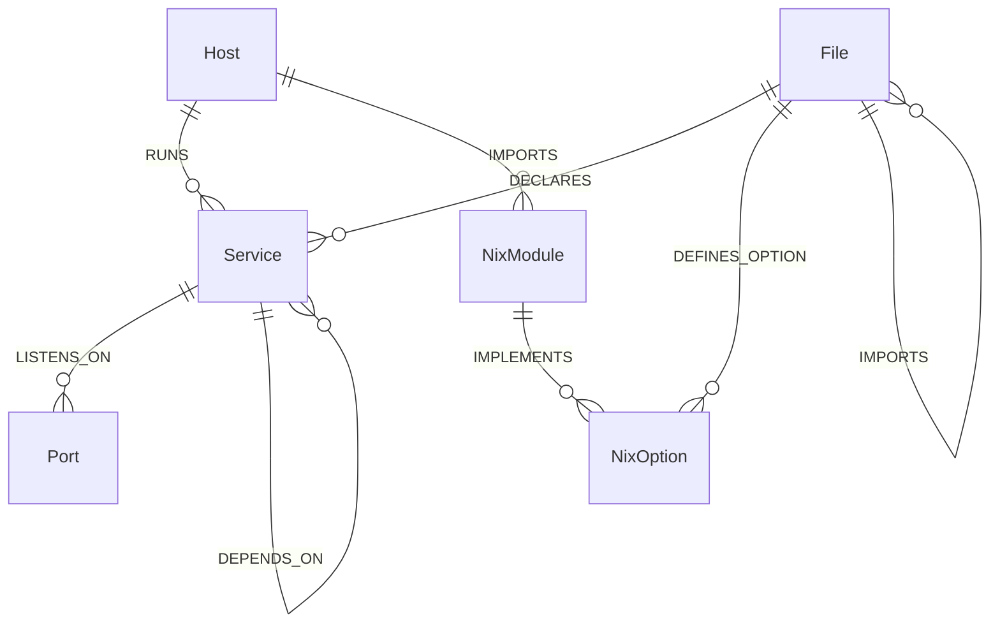

# Modelo de Schema Neo4j — Kryonix Brain & GraphRAG

Status: Especificação Técnica de Produção / Consolidado

Este documento estabelece o **schema mínimo e a ontologia formal** do Neo4j para o **Kryonix Brain**. Ele serve como o mapa de referência para engenheiros de dados, agentes autônomos e geradores de consultas **Text2Cypher** para representar de forma direcionada a arquitetura declarativa NixOS e as dependências operacionais do repositório.

---

## 🕸️ Visão Geral da Ontologia

O objetivo de modelar o Kryonix em um grafo local e derivado é permitir consultas complexas multi-hop (múltiplos saltos), análise de causa-raiz e rastreabilidade declarativa. 

A ontologia é organizada em três camadas conceituais:
1. **Camada de Infraestrutura/Física:** Hosts, Serviços em execução e Portas de rede de comunicação.
2. **Camada Declarativa/Nix:** Arquivos de configuração, módulos NixOS e opções de configuração.
3. **Camada de Auditoria/Proveniência:** Atributos de hash, caminhos de arquivo originais e metadados de commit para garantir integridade e auditoria sem segredos.

---

## 📊 Diagrama de Relacionamento (Entity-Relationship Model)



---

## 🗂️ Especificação de Nós e Propriedades

### 1. Nó: `Host`
Representa um nó físico ou máquina virtual em operação no ecossistema Kryonix.

* **Constraint de Unicidade:** `Host.name`
* **Propriedades:**

| Propriedade | Tipo | Descrição | Exemplo |
| :--- | :--- | :--- | :--- |
| `name` | `String` | Identificador único e canônico da máquina. | `"glacier"` |
| `role` | `String` | Papel desempenhado no ecossistema. | `"server"` |
| `ip_lan` | `String` | Endereço de IP na rede local física. | `"10.0.0.2"` |
| `ip_tailscale` | `String` | Endereço IP VPN do Tailscale. | `"100.64.12.8"` |
| `is_active` | `Boolean` | Se a máquina está ativa operacionalmente. | `true` |
| `source_path` | `String` | Caminho do arquivo Nix que configura o host. | `"hosts/glacier/default.nix"` |

---

### 2. Nó: `Service`
Representa um daemon ou serviço gerenciado pelo systemd/NixOS.

* **Constraint de Unicidade:** `Service.name`
* **Propriedades:**

| Propriedade | Tipo | Descrição | Exemplo |
| :--- | :--- | :--- | :--- |
| `name` | `String` | Nome do serviço/systemd unit. | `"kryonix-brain"` |
| `description` | `String` | Resumo legível da finalidade do serviço. | `"Kryonix Brain API Engine"` |
| `type` | `String` | Tipo de empacotamento ou runtime. | `"systemd"` |
| `bind_address` | `String` | Interface de rede à qual o serviço se associa. | `"127.0.0.1"` |
| `status` | `String` | Estado atual do ciclo de vida declarativo. | `"active"` |
| `source_path` | `String` | Módulo declarativo de onde se origina. | `"modules/nixos/services/brain.nix"` |

---

### 3. Nó: `File`
Representa um arquivo rastreado ou de configuração no repositório de infraestrutura.

* **Constraint de Unicidade:** `File.path`
* **Propriedades:**

| Propriedade | Tipo | Descrição | Exemplo |
| :--- | :--- | :--- | :--- |
| `path` | `String` | Caminho relativo do arquivo dentro do repositório. | `"hosts/glacier/networking.nix"` |
| `type` | `String` | Extensão ou categoria sintática do arquivo. | `"nix"` |
| `sha256` | `String` | Hash SHA-256 do arquivo para auditoria. | `"4ab8...c72d"` |
| `size_bytes` | `Integer` | Tamanho do arquivo físico em bytes. | `2481` |
| `indexed_at` | `String` | Registro ISO de data e hora de indexação. | `"2026-05-07T03:54:00Z"` |

---

### 4. Nó: `Port`
Representa uma porta lógica de comunicação em rede TCP ou UDP.

* **Constraint de Unicidade:** `Port.number` (Combinado com `protocol`)
* **Propriedades:**

| Propriedade | Tipo | Descrição | Exemplo |
| :--- | :--- | :--- | :--- |
| `number` | `Integer` | Número da porta de rede. | `8000` |
| `protocol` | `String` | Protocolo de camada de transporte da porta. | `"tcp"` |

---

### 5. Nó: `NixModule`
Representa um módulo declarativo composto no Flake do Kryonix.

* **Constraint de Unicidade:** `NixModule.name`
* **Propriedades:**

| Propriedade | Tipo | Descrição | Exemplo |
| :--- | :--- | :--- | :--- |
| `name` | `String` | Nome qualificatório do módulo no namespace. | `"services.ollama"` |
| `path` | `String` | Caminho de arquivo que hospeda a definição. | `"modules/nixos/services/ollama.nix"` |

---

### 6. Nó: `NixOption`
Representa uma opção de configuração declarada no namespace do Kryonix.

* **Constraint de Unicidade:** `NixOption.name`
* **Propriedades:**

| Propriedade | Tipo | Descrição | Exemplo |
| :--- | :--- | :--- | :--- |
| `name` | `String` | Nome canônico absoluto da opção. | `"services.ollama.enable"` |
| `type` | `String` | Tipo do valor (bool, string, package, etc). | `"boolean"` |
| `default_value` | `String` | Valor padrão avaliado pelo Nix. | `"false"` |
| `description` | `String` | Explicação de uso para o operador do sistema. | `"Habilita serviço do Ollama local"` |

---

## 🔗 Semântica de Relacionamentos

A direcionalidade e a semântica dos arcos garantem consultas intuitivas de dependência:

1. **`(Host)-[:RUNS]->(Service)`**
   * *Significado:* O Host físico executa ativamente a instância do serviço.
2. **`(Service)-[:LISTENS_ON]->(Port)`**
   * *Significado:* O serviço abre um socket de escuta na porta de rede indicada.
3. **`(File)-[:DECLARES]->(Service)`**
   * *Significado:* O arquivo Nix declara explicitamente a definição do daemon ou serviço systemd.
4. **`(File)-[:DEFINES_OPTION]->(NixOption)`**
   * *Significado:* O arquivo contém a declaração de tipo e interface de uma opção.
5. **`(File)-[:IMPORTS]->(File)`**
   * *Significado:* Um arquivo Nix importa outro em sua lista de `imports = [ ... ]`.
6. **`(Host)-[:IMPORTS]->(NixModule)`**
   * *Significado:* A composição do host importa e ativa o respectivo módulo.
7. **`(Service)-[:DEPENDS_ON]->(Service)`**
   * *Significado:* Relação de ordem operacional (ex: o `kryonix-brain` necessita que o `ollama` esteja ativo primeiro).

---

## 🛡️ DDL do Banco de Dados (Constraints de Unicidade)

Para garantir consistência referencial absoluta e evitar nós duplicados no banco de dados durante cargas ou atualizações incrementais, os índices e constraints a seguir devem ser declarados no Neo4j:

```cypher
// Criar constraints de unicidade obrigatórias
CREATE CONSTRAINT host_name_unique IF NOT EXISTS
FOR (h:Host) REQUIRE h.name IS UNIQUE;

CREATE CONSTRAINT service_name_unique IF NOT EXISTS
FOR (s:Service) REQUIRE s.name IS UNIQUE;

CREATE CONSTRAINT file_path_unique IF NOT EXISTS
FOR (f:File) REQUIRE f.path IS UNIQUE;

CREATE CONSTRAINT port_number_unique IF NOT EXISTS
FOR (p:Port) REQUIRE p.number IS UNIQUE;

CREATE CONSTRAINT nix_module_name_unique IF NOT EXISTS
FOR (m:NixModule) REQUIRE m.name IS UNIQUE;

CREATE CONSTRAINT nix_option_name_unique IF NOT EXISTS
FOR (o:NixOption) REQUIRE o.name IS UNIQUE;
```

---

## 🔍 Exemplos Práticos de Consultas Cypher (Grounding de IA)

Estes exemplos demonstram como o motor **Text2Cypher** traduzirá perguntas naturais em buscas exatas no grafo do Kryonix:

### Consulta 1: Relações Cruzadas e Vulnerabilidade de Portas
> *"Existem portas duplicadas em uso por diferentes serviços em hosts?"*
```cypher
MATCH (h:Host)-[:RUNS]->(s:Service)-[:LISTENS_ON]->(p:Port)
WITH p.number AS portNum, collect(s.name) AS services, collect(h.name) AS hosts
WHERE size(services) > 1
RETURN portNum, services, hosts;
```

### Consulta 2: Rastreamento de Dependência Circular de Módulos
> *"Quais arquivos realizam imports recíprocos (ciclos) no repositório?"*
```cypher
MATCH (f1:File)-[:IMPORTS]->(f2:File)-[:IMPORTS]->(f1)
RETURN f1.path AS ArquivoA, f2.path AS ArquivoB;
```

### Consulta 3: Impacto de Causa-Raiz e Falhas de Serviços
> *"Se o Ollama cair, quais serviços instalados nos hosts serão afetados por dependência direta ou indireta?"*
```cypher
MATCH path = (affected:Service)-[:DEPENDS_ON*1..3]->(target:Service {name: "ollama"})
MATCH (h:Host)-[:RUNS]->(affected)
RETURN h.name AS Host, affected.name AS ServicoAfetado, length(path) AS Distancia;
```
