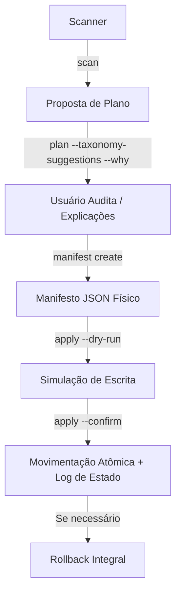

# Kryonix Home Brain

O **Kryonix Home Brain** (`kryonix-home`) é o motor seguro, declarativo e determinístico de organização da pasta pessoal (Home) do usuário no Kryonix.

Ele ajuda a manter a Home limpa e estruturada, classificando arquivos de entrada (como novos arquivos na pasta `Downloads`) em categorias lógicas e limpando seus nomes automaticamente de forma segura e reversível.

---

## 1. Comandos Operacionais

O Kryonix Home Brain oferece uma CLI integrada por meio do comando `kryonix home`.

```bash
kryonix home scan                             # Varre os diretórios de entrada (Downloads)
kryonix home report                           # Mostra estatísticas e relatórios de uso da Home
kryonix home duplicates                       # Lista arquivos duplicados com base em SHA-256
kryonix home categories                       # Mostra todas as categorias de taxonomia disponíveis
kryonix home categories --json                # Retorna as categorias em formato JSON estruturado
kryonix home explain <caminho>                # Explica heurística e score de classificação de um arquivo
kryonix home plan --taxonomy-suggestions --rename-suggestions --why
                                              # Gera um plano de organização completo detalhando o porquê
kryonix home manifest create --taxonomy-suggestions --rename-suggestions
                                              # Cria um manifesto auditável com todas as ações propostas
kryonix home manifest show                     # Exibe o manifesto atual em formato legível
kryonix home apply --dry-run                  # Simula as movimentações do manifesto físico
kryonix home apply --confirm                  # Aplica fisicamente as movimentações na Home
kryonix home rollback                         # Reverte 100% da última operação aplicada
```

---

## 2. Fluxo Seguro Transacional (Safety First)

Para garantir que nenhum dado seja perdido ou corrompido, o motor segue um fluxo estrito de **Planejamento, Auditoria, Aplicação e Rollback**:



### Salvaguardas embutidas:
- **Inexistência de Auto-Delete**: O sistema apenas move e renomeia arquivos. **Nenhuma** ação de exclusão física é realizada.
- **Prevenção de Sobrescrita (Anti-Overwrite)**: Se o arquivo de destino já existir:
  - Se os hashes SHA-256 forem idênticos, a ação é pulada (`skipped`).
  - Se os hashes divergirem, a ação é bloqueada (`blocked` / `destination_exists`) e o arquivo original permanece intacto na origem.
- **Tamanho Limite**: Arquivos com mais de 2 GiB são pulados pelo planejador para economizar tempo e CPU, a menos que a flag `--include-large-files` seja especificada.
- **Isolamento de Configurações**: Pastas ocultas (como `.config`, `.local`) e arquivos do sistema nunca são tocados pelo motor.

---

## 3. Diretórios e Arquivos de Estado

O Kryonix Home Brain armazena seu estado transacional e de auditoria em:

- **Manifestos**: `~/.local/state/kryonix/home-brain/manifests/manifest_YYYYMMDD_HHMMSS.json`
- **Logs de Auditoria**: `~/.local/state/kryonix/home-brain/audit/audit_YYYYMMDD_HHMMSS.json`
- **Transação Ativa**: `~/.local/state/kryonix/home-brain/active_transaction.json` (usado para rollback)

---

## 4. Testando e Validando em Sandbox (Recomendado)

Você pode simular o comportamento do Kryonix Home Brain de forma 100% segura sem alterar sua Home real, apontando a variável `HOME` para um diretório temporário:

```bash
# 1. Criar sandbox temporário
tmp="$(mktemp -d)"
mkdir -p "$tmp/Downloads"

# 2. Criar arquivos de teste
printf "dados\n" > "$tmp/Downloads/comprovante pix banco.pdf"
printf "dados\n" > "$tmp/Downloads/boleto energia.pdf"

# 3. Executar o fluxo completo no sandbox
HOME="$tmp" kryonix home scan
HOME="$tmp" kryonix home plan --taxonomy-suggestions --rename-suggestions --why
HOME="$tmp" kryonix home manifest create --taxonomy-suggestions --rename-suggestions
HOME="$tmp" kryonix home apply --confirm

# 4. Verificar resultado e reverter
find "$tmp" -type f
HOME="$tmp" kryonix home rollback

# 5. Limpar sandbox
rm -rf "$tmp"
```

---

## 5. Personalizando a Taxonomia

Para personalizar as regras de correspondência heurística e os destinos, crie um arquivo declarativo em:

```txt
~/.config/kryonix/home-taxonomy.toml
```

Veja mais informações no guia de [Configuração da Taxonomia](PHASE_3B_TAXONOMY.md) ou no runbook de [Operações](OPERATIONS.md).
