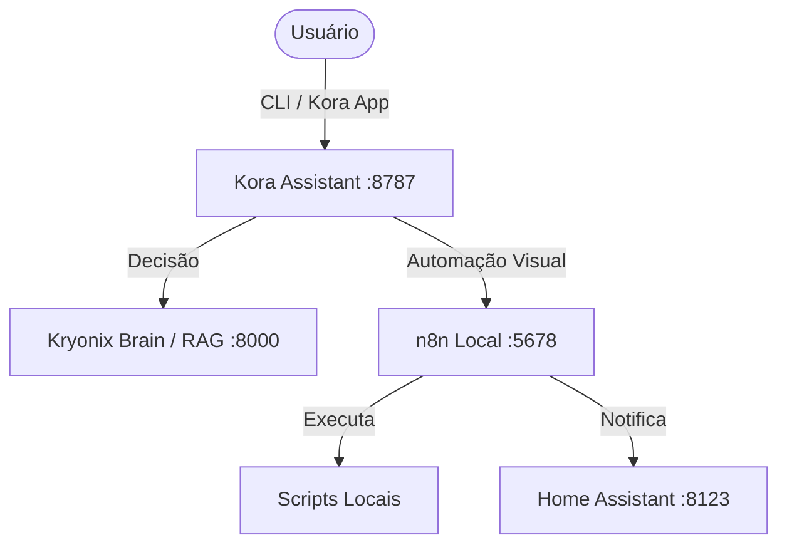

# Integração Local Kora + n8n

O Kryonix utiliza o **n8n** como motor de automação visual ("braço de orquestração"), sendo acionado pela Kora. A diretriz principal é a **soberania de dados**: o n8n roda 100% isolado no Glacier, sem gateways públicos ou dependências cloud (como Hostinger ou webhooks abertos).

## Arquitetura



## Configuração do Servidor (Glacier)

O módulo n8n é ativado em `kryonix.services.n8n.enable = true`. Por segurança, a porta `5678` NÃO é exposta no firewall.

### 1. Criando o ambiente do n8n

O n8n necessita de uma chave de criptografia gerada localmente. O arquivo `/etc/kryonix/n8n.env` deve conter os *secrets* e nunca deve ser incluído no repositório.

Crie o arquivo no Glacier via shell:
```bash
sudo mkdir -p /etc/kryonix
echo "N8N_ENCRYPTION_KEY=$(python3 -c 'import secrets; print(secrets.token_urlsafe(32))')" | sudo tee /etc/kryonix/n8n.env
echo "N8N_BASIC_AUTH_USER=admin" | sudo tee -a /etc/kryonix/n8n.env
echo "N8N_BASIC_AUTH_PASSWORD=admin" | sudo tee -a /etc/kryonix/n8n.env
sudo chown root:n8n /etc/kryonix/n8n.env
sudo chmod 0640 /etc/kryonix/n8n.env
```

*Substitua os dados de `BASIC_AUTH` por credenciais seguras.*

## Acesso Remoto Seguro (Tunnel)

Como o n8n não está aberto na rede, você deve acessá-lo usando SSH Tunneling a partir do seu Inspiron (ou qualquer client autorizado):

```bash
# Encaminhar a porta 5678 do Glacier para a porta 15678 do Inspiron
ssh -p 2224 -N -L 15678:127.0.0.1:5678 glacier-public
```

Após iniciar o túnel, acesse no navegador local:
http://127.0.0.1:15678

## Configuração da Kora

A Kora utiliza webhooks internos do n8n para delegar tarefas estruturadas. Para adicionar segurança nesses webhooks, defina uma chave de token no `/etc/kryonix/kora.env`:

```env
KORA_N8N_WEBHOOK_TOKEN=chave_super_secreta_webhook
KORA_N8N_BASE_URL=http://127.0.0.1:5678
```

Ao criar workflows no n8n, utilize o nó de **Webhook**, e adicione autenticação do tipo "Header Auth" verificando a chave `X-Kora-Token` igual a `chave_super_secreta_webhook`.
