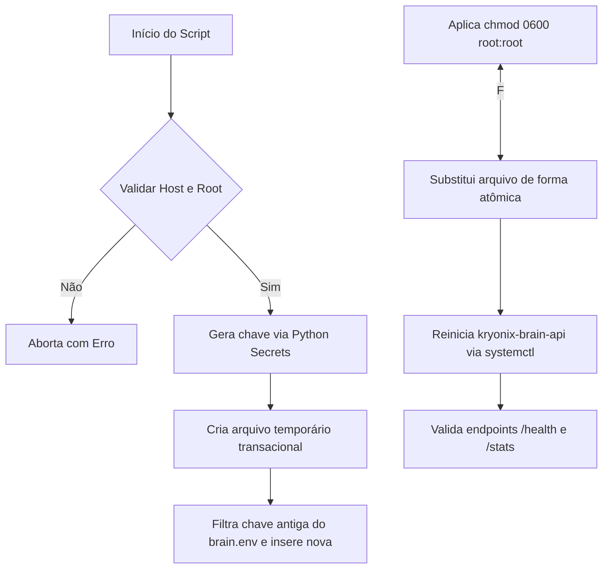

# Rotação da Chave de API do Kryonix Brain

Status: Ativo / Produção

Este guia descreve os procedimentos de segurança, o modelo de permissões e as instruções de execução para rotacionar periodicamente a chave de segurança da **Kryonix Brain API**.

---

## 1. Modelo de Segurança e Armazenamento

A chave de API protege os endpoints analíticos e administrativos do cérebro (como `/stats`, `/notes/propose`, `/ingest` e indexadores de LightRAG) de acessos não autorizados.

### Princípios de Hardening Aplicados:
1. **Segredos Fora do Nix Store:** O Nix Store é world-readable por padrão. Para evitar o vazamento de chaves privadas nos logs e diretórios Nix, a chave de API é lida dinamicamente do arquivo local `/etc/kryonix/brain.env`.
2. **Permissões Rígidas:** O arquivo `/etc/kryonix/brain.env` deve ser mantido estritamente com permissões `0600` e de propriedade exclusiva do `root:root`.
3. **Isolamento de Runtime:** O daemon systemd `kryonix-brain-api` importa esse arquivo sob demanda via diretiva `EnvironmentFile=`.

---

## 2. Executando a Rotação Automática

O script de rotação `/etc/kryonix/scripts/rotate-kryonix-brain-api-key.sh` foi desenvolvido para executar a substituição da chave de forma atômica e transacional.

### Requisitos Prévios:
- O script **só permite execução** no servidor **Glacier**.
- É obrigatório privilégio de superusuário (`sudo` / `root`).

### Como Executar:
No terminal do Glacier, execute:
```bash
sudo /etc/kryonix/scripts/rotate-kryonix-brain-api-key.sh
```

### O que o Script Executa nos Bastidores:


---

## 3. Verificação Manual e Solução de Problemas

Se for necessária uma verificação manual da chave ou se o serviço apresentar comportamento inesperado:

### 1. Inspecionar Permissões do Arquivo
```bash
ls -la /etc/kryonix/brain.env
# Esperado: -rw------- 1 root root ...
```

### 2. Verificar Logs do Serviço
Se a API falhar em carregar após a rotação, visualize o journal:
```bash
sudo journalctl -u kryonix-brain-api -n 50 --no-pager
```

### 3. Teste Manual com cURL
Você pode validar manualmente que a autenticação está funcionando perfeitamente de forma local no Glacier:
```bash
# Ler a chave de API de forma segura
API_KEY=$(sudo grep "^KRYONIX_BRAIN_KEY=" /etc/kryonix/brain.env | cut -d'=' -f2)

# Fazer a requisição autenticada
curl -i -H "X-API-Key: $API_KEY" http://127.0.0.1:8000/stats
```
Se retornar código HTTP `200 OK` com dados JSON do grafo, a rotação foi bem-sucedida!
Se retornar `403 Forbidden` ou `401 Unauthorized`, revise se a chave em `/etc/kryonix/brain.env` coincide exatamente com a lida pelo daemon da API.
