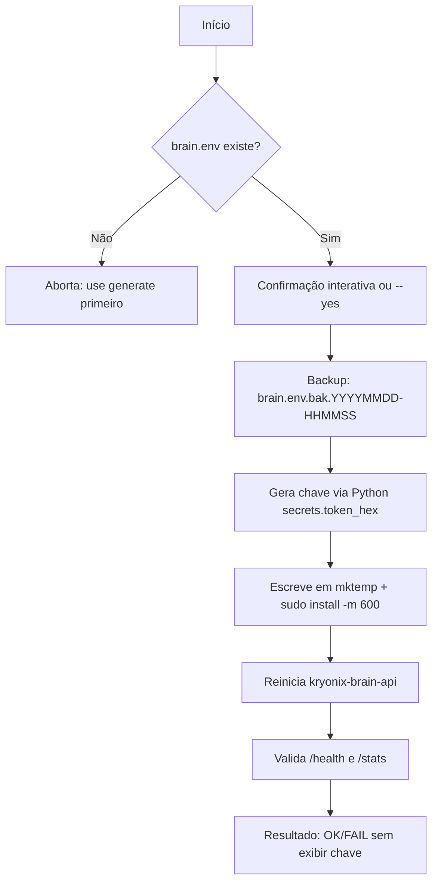

# Rotação da Chave de API do Kryonix Brain

Status: Ativo / Produção

Este guia descreve o modelo de segurança e os procedimentos para gerenciar a chave de API da **Kryonix Brain API**.

---

## 1. Modelo de Segurança e Armazenamento

A chave de API protege os endpoints analíticos e administrativos do cérebro (como `/stats`, `/search`, `/notes/propose`, `/ingest` e `/graph/*`) de acessos não autorizados.

### Princípios de Hardening Aplicados:
1. **Segredos Fora do Nix Store:** O Nix Store é world-readable por padrão. Para evitar o vazamento de chaves privadas nos logs e diretórios Nix, a chave de API é lida dinamicamente do arquivo local `/etc/kryonix/brain.env`.
2. **Permissões Rígidas:** O arquivo `/etc/kryonix/brain.env` deve ser mantido estritamente com permissões `0600` e de propriedade exclusiva do `root:root`.
3. **Isolamento de Runtime:** O daemon systemd `kryonix-brain-api` importa esse arquivo sob demanda via diretiva `EnvironmentFile=`.

### Variável canônica:

```txt
KRYONIX_BRAIN_API_KEY
```

> ⚠️ Nomes antigos como `KRYONIX_BRAIN_KEY` não devem ser usados.

---

## 2. Gerenciamento via CLI

A forma recomendada de gerenciar a chave é pela CLI do Kryonix:

```bash
# Verificar status atual
kryonix brain api-key status

# Gerar chave (não sobrescreve existente)
kryonix brain api-key generate

# Rotacionar chave (backup + nova chave + restart + validação)
kryonix brain api-key rotate

# Rotacionar sem confirmação interativa
kryonix brain api-key rotate --yes

# Validar chave contra a API
kryonix brain api-key validate
```

### O que `rotate` faz:



---

## 3. Verificação Manual

Se for necessária uma verificação manual da chave ou se o serviço apresentar comportamento inesperado:

### 1. Inspecionar Permissões do Arquivo
```bash
sudo stat -c "%U:%G %a %n" /etc/kryonix/brain.env
# Esperado: root:root 600 /etc/kryonix/brain.env
```

### 2. Verificar Logs do Serviço
```bash
sudo journalctl -u kryonix-brain-api -n 50 --no-pager
```

### 3. Teste Manual com cURL (sem exibir a chave)
```bash
# Health check (público)
curl -fsS http://127.0.0.1:8000/health

# Stats autenticado (chave lida e descartada)
K="$(sudo sed -n 's/^KRYONIX_BRAIN_API_KEY=//p' /etc/kryonix/brain.env)"
curl -fsS -H "X-API-Key: $K" http://127.0.0.1:8000/stats | jq .
unset K
```

Se retornar código HTTP `200 OK` com dados JSON, a chave está válida.
Se retornar `403 Forbidden` ou `401 Unauthorized`, rode `kryonix brain api-key rotate`.

---

## 4. Geração Manual Emergencial

Só usar se a CLI estiver quebrada:

```bash
KEY="$(python3 -c 'import secrets; print(secrets.token_hex(32))')"
tmp="$(mktemp)"
printf "KRYONIX_BRAIN_API_KEY=%s\n" "$KEY" > "$tmp"
sudo install -m 600 -o root -g root "$tmp" /etc/kryonix/brain.env
rm -f "$tmp"
unset KEY
sudo systemctl restart kryonix-brain-api
sudo stat -c "%U:%G %a %n" /etc/kryonix/brain.env
```

---

## 5. Referências

- [AGENTS.md — seção 11.4](../../AGENTS.md) — regra canônica
- [README.md — IA local](../../README.md#ia-local-e-serviços-do-brain) — setup inicial
- [CLI brain.sh](../../packages/kryonix-cli/brain.sh) — implementação
